# 游戏策划文档

## 项目概述

# 项目概述

## 1. 项目背景

当前公司70人团队正在开发Unity钓鱼手游，但遇到核心数值设计问题：

- **物理驱动导致数值混乱**：大鱼比小鱼更快上钩，违背游戏体验预期
- **缺乏清晰的数值参考**：团队需要可验证的数值模型来指导Unity项目开发
- **心流体验不明确**：不同鱼种的难度曲线、装备成长路径需要快速迭代验证

## 2. 项目目标

构建一个**基于Web技术的钓鱼游戏数值验证Demo**，用于：

1. **验证核心数值设计**：鱼种属性、装备体系、经济循环的合理性
2. **模拟长期游戏体验**：通过时间加速快速跑通数十小时的游戏数据
3. **提供可视化参考**：为Unity团队提供清晰的物理模型和数值标准

## 3. 技术选型

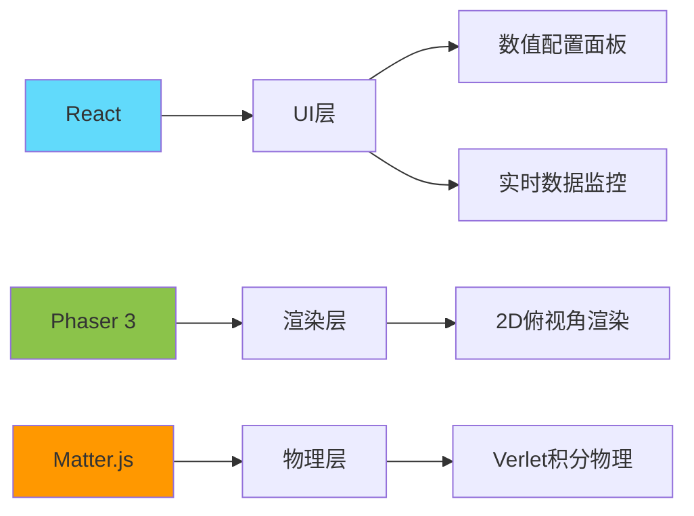
```mermaid
graph LR
    A[React] --> B[UI层]
    C[Phaser 3] --> D[渲染层]
    E[Matter.js] --> F[物理层]
    
    B --> G[数值配置面板]
    B --> H[实时数据监控]
    D --> I[2D俯视角渲染]
    F --> J[Verlet积分物理]
    
    style A fill:#61dafb
    style C fill:#8bc34a
    style E fill:#ff9800
```

**选型理由**：
- **React**：组件化UI开发，适合AI辅助快速迭代
- **Phaser 3**：成熟的2D游戏引擎，内置物理引擎集成
- **Matter.js**：基于Verlet积分的物理引擎，性能可控（单核CPU）

## 4. 核心功能范围

### 4.1 完整钓鱼流程

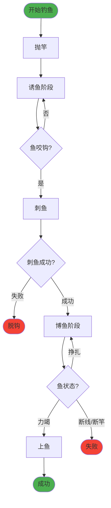
```mermaid
flowchart TD
    Start([开始钓鱼]) --> Cast[抛竿]
    Cast --> Lure[诱鱼阶段]
    Lure --> Bite{鱼咬钩?}
    Bite -->|否| Lure
    Bite -->|是| Hook[刺鱼]
    Hook --> Fight{刺鱼成功?}
    Fight -->|失败| End1([脱钩])
    Fight -->|成功| Battle[博鱼阶段]
    Battle --> Check{鱼状态?}
    Check -->|挣扎| Battle
    Check -->|力竭| Land[上鱼]
    Check -->|断线/断竿| End2([失败])
    Land --> End3([成功])
    
    style Start fill:#4caf50
    style End1 fill:#f44336
    style End2 fill:#f44336
    style End3 fill:#4caf50
```

### 4.2 物理系统

| 组件 | 实现方案 | 参数 |
|------|---------|------|
| **鱼线** | 15-20个Verlet粒子 | 弧度、波动、张力 |
| **鱼竿** | 8-10个物理点骨骼 | 侧向弯曲（贝塞尔曲线）、轴向刚体 |
| **力的单位** | 千克力(kgf) | 耐力扣减时转换为牛顿(N)，系数9.81 |

### 4.3 博鱼核心机制

**鱼体力扣减公式**：
```
耐力损失 = PlayerForce(N) × ΔT
```

**泄力系统**（动态摩擦力模型）：
```
当 线张力 > 泄力阈值:
    摩擦力 = 泄力阈值 × 动摩擦系数(0.7)
    滑出速度 = (净拉力 / 线阻尼系数)
```

**玩家消耗**：
```
优先扣除能量（自动回复）
能量耗尽后：100能量 = 1体力
能量消耗 = (竿能量系数 + 轮能量系数×传动比) × 传递到手的力 × ΔT
```

### 4.4 鱼AI系统

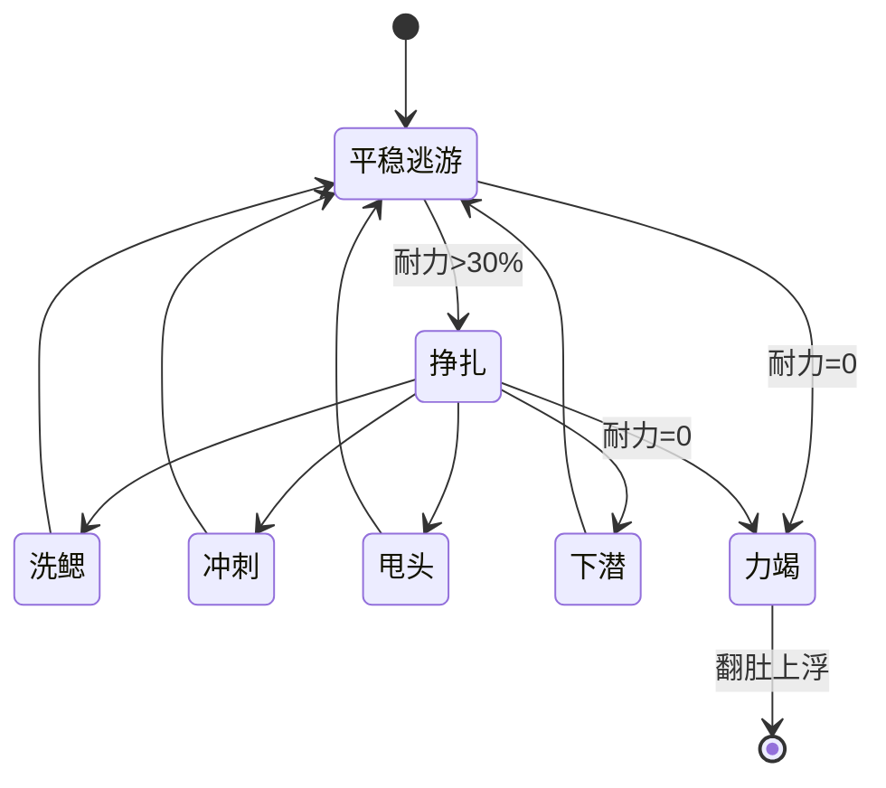
```mermaid
stateDiagram-v2
    [*] --> 平稳逃游
    平稳逃游 --> 挣扎: 耐力>30%
    挣扎 --> 洗鳃
    挣扎 --> 冲刺
    挣扎 --> 甩头
    挣扎 --> 下潜
    洗鳃 --> 平稳逃游
    冲刺 --> 平稳逃游
    甩头 --> 平稳逃游
    下潜 --> 平稳逃游
    平稳逃游 --> 力竭: 耐力=0
    挣扎 --> 力竭: 耐力=0
    力竭 --> [*]: 翻肚上浮
```

**实现方式**：行为树（JSON配置），支持不同鱼种配置不同行为偏好

## 5. 时间系统

- **Session配置**：可设置游戏内时间段（如中午30分钟 + 晚上30分钟）
- **全局加速倍率**：1x / 2x / 5x / 10x
- **用途**：
  - 高速模拟：快速跑通数十小时游戏数据
  - 慢速观察：降速查看关键物理细节和数值变化

## 6. 操作模式

- **自动模拟**：AI自动执行钓鱼流程，收集数据
- **人工接管**：键盘快捷键随时介入，手动调整策略
- **目的**：平衡自动化数据收集与人工体验验证

## 7. 经济系统

### 收益来源
- 卖鱼（按鱼种/重量）
- 任务奖励
- 排行榜奖励
- 成就/图鉴奖励

### 消耗项
- 购买/升级装备（竿/轮/线/饵）
- 维修钓具
- 补充体力
- 解锁钓场
- 补充饵料

### 耐久度机制
**混合模式**：受力程度 + 时间衰减

| 受力范围 | 耐久损耗倍率 |
|---------|------------|
| 0-100% | 1x（线性） |
| 100-150% | 2-5x（加速） |
| 150-200% | 10-20x（暴力） |
| >200% | 直接断裂 |

## 8. 装备属性维度

| 装备类型 | 核心属性 |
|---------|---------|
| **鱼竿** | 承载上限(kgf)、硬度/调性、能量消耗系数、耐久度上限 |
| **轮子** | 传动比、泄力上限、能量消耗系数、耐久度上限 |
| **鱼线** | 拉力值(kgf)、线径（影响水阻）、耐久度 |

## 9. 项目交付物

1. **可运行的Web Demo**：支持浏览器直接访问
2. **数值配置系统**：JSON格式，可快速调整参数
3. **数据导出功能**：CSV/JSON格式，用于数据分析
4. **技术文档**：物理模型、数值公式、AI行为树说明
5. **Unity移植指南**：关键算法和数值标准的移植建议

## 核心玩法流程

# 核心玩法流程

## 1. 完整钓鱼流程

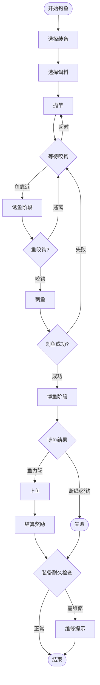
```mermaid
flowchart TD
    Start([开始钓鱼]) --> SelectGear[选择装备]
    SelectGear --> SelectBait[选择饵料]
    SelectBait --> Cast[抛竿]
    
    Cast --> WaitBite{等待咬钩}
    WaitBite -->|超时| Cast
    WaitBite -->|鱼靠近| Lure[诱鱼阶段]
    
    Lure --> Bite{鱼咬钩?}
    Bite -->|逃离| WaitBite
    Bite -->|咬钩| Hook[刺鱼]
    
    Hook --> HookSuccess{刺鱼成功?}
    HookSuccess -->|失败| WaitBite
    HookSuccess -->|成功| Fight[博鱼阶段]
    
    Fight --> FightResult{博鱼结果}
    FightResult -->|断线/脱钩| Fail([失败])
    FightResult -->|鱼力竭| Land[上鱼]
    
    Land --> Reward[结算奖励]
    Reward --> DurabilityCheck{装备耐久检查}
    DurabilityCheck -->|需维修| Repair[维修提示]
    DurabilityCheck -->|正常| End([结束])
    Repair --> End
    
    Fail --> DurabilityCheck
```

## 2. 阶段详细说明

### 2.1 准备阶段

**装备选择**
- 根据目标鱼种选择合适的竿/轮/线组合
- 系统提示装备承载范围与目标鱼体重的匹配度
- 检查装备耐久度（<30%红色警告）

**饵料选择**
- 不同饵料吸引不同鱼种（吸引力系数0.5-2.0）
- 饵料消耗：每次抛竿-1，咬钩失败-1
- 库存不足时自动提示购买

### 2.2 抛竿阶段

**操作方式**
- 自动模式：系统自动选择随机落点（钓场有效区域内）
- 手动模式：按住空格键蓄力（0.5-2秒），释放抛出

**物理计算**
```
抛竿距离 = 蓄力时间 × 竿抛投系数 × (1 - 风阻系数)
落点偏移 = 随机偏移(-5%, +5%) + 风向影响
```

**鱼线展开**
- 15-20个Verlet粒子从竿尖依次展开
- 重力+水阻力作用下形成自然弧线
- 浮漂/铅坠影响沉降速度

### 2.3 诱鱼阶段

**鱼AI感知**
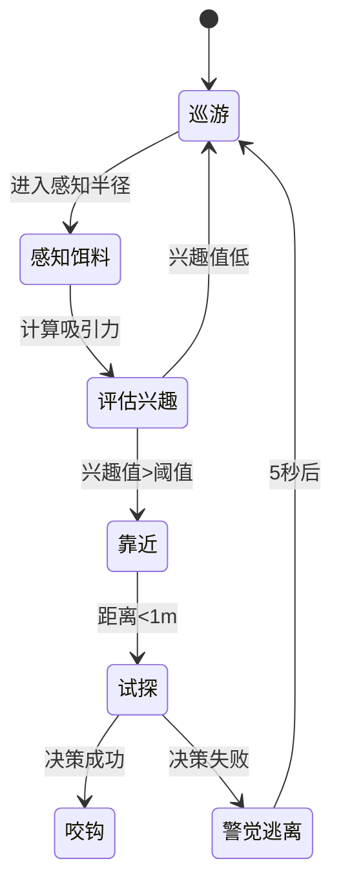
```mermaid
stateDiagram-v2
    [*] --> 巡游
    巡游 --> 感知饵料: 进入感知半径
    感知饵料 --> 评估兴趣: 计算吸引力
    评估兴趣 --> 靠近: 兴趣值>阈值
    评估兴趣 --> 巡游: 兴趣值低
    靠近 --> 试探: 距离<1m
    试探 --> 咬钩: 决策成功
    试探 --> 警觉逃离: 决策失败
    警觉逃离 --> 巡游: 5秒后
```

**吸引力计算**
```
基础吸引力 = 饵料吸引系数 × 鱼种偏好系数
距离衰减 = max(0, 1 - 距离/感知半径)
最终吸引力 = 基础吸引力 × 距离衰减 × 随机波动(0.8-1.2)
```

**时间限制**
- 单次抛竿最长等待时间：60-180秒（可配置）
- 超时自动收竿，饵料不消耗

### 2.4 刺鱼阶段

**触发时机**
- 鱼咬钩后0.5-2秒内的随机时刻
- UI显示"！"提示符 + 震动反馈（移动端）

**操作判定**
- 自动模式：系统在0.2-0.5秒内自动响应
- 手动模式：按空格键刺鱼
- 判定窗口：1.5秒（过早/过晚均失败）

**成功条件**
```
刺鱼力度 = 竿硬度系数 × 提竿速度
成功判定 = (刺鱼力度 > 鱼口部强度 × 0.8) && (响应时间 < 1.5s)
```

**失败后果**
- 鱼逃离，饵料消耗-1
- 装备耐久度轻微损耗（-0.1%）

### 2.5 博鱼阶段（核心）

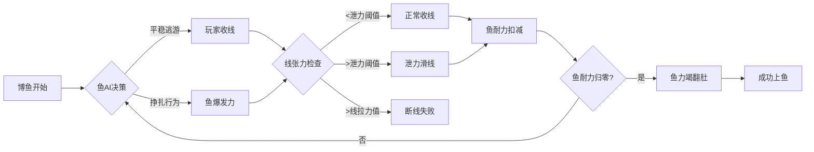
```mermaid
flowchart LR
    A[博鱼开始] --> B{鱼AI决策}
    B -->|平稳逃游| C[玩家收线]
    B -->|挣扎行为| D[鱼爆发力]
    
    C --> E{线张力检查}
    D --> E
    
    E -->|<泄力阈值| F[正常收线]
    E -->|>泄力阈值| G[泄力滑线]
    E -->|>线拉力值| H[断线失败]
    
    F --> I[鱼耐力扣减]
    G --> I
    
    I --> J{鱼耐力归零?}
    J -->|否| B
    J -->|是| K[鱼力竭翻肚]
    K --> L[成功上鱼]
```

**力学平衡**
```
线张力 = |鱼拉力 - 玩家收线力| + 水阻力 + 鱼线自重

当线张力 > 泄力阈值:
    摩擦力 = 泄力阈值 × 动摩擦系数(0.7)
    滑出速度 = (线张力 - 摩擦力) / 线阻尼系数
    
鱼耐力扣减 = 玩家收线力(N) × ΔT / 鱼耐力系数
玩家能量消耗 = (竿能量系数 + 轮能量系数×传动比) × 传递力 × ΔT
```

**鱼AI行为**

| 行为类型 | 触发条件 | 力度倍率 | 持续时间 | 耐力消耗 |
|---------|---------|---------|---------|---------|
| 平稳逃游 | 默认状态 | 1.0x | 持续 | 1x |
| 洗鳃 | 耐力>60% | 1.5-2.0x | 2-4秒 | 3x |
| 冲刺 | 耐力>40% | 2.5-3.5x | 1-3秒 | 5x |
| 甩头 | 随机触发 | 1.2-1.8x | 0.5-1秒 | 2x |
| 下潜 | 近水面时 | 2.0-3.0x | 3-6秒 | 4x |
| 力竭翻肚 | 耐力=0 | 0.1x | 直至上鱼 | 0 |

**玩家策略**
- 主动收线：高能量消耗，快速扣减鱼耐力
- 被动跟鱼：低能量消耗，依靠泄力系统保护装备
- 调整泄力：实时调节泄力阈值（50%-100%线拉力值）

**失败条件**
1. 线张力超过线拉力值 → 断线
2. 鱼竿受力超过承载上限200% → 断竿
3. 玩家体力归零 → 脱力松手
4. 鱼逃出钓场边界 → 脱钩

### 2.6 上鱼阶段

**收网动画**
- 鱼力竭后自动触发（或手动按E键）
- 最后5米匀速拖拽（2秒动画）
- 展示鱼种、体重、品质

**奖励结算**
```
基础金币 = 鱼种基础价 × 体重系数 × 品质系数
额外奖励:
  - 首次捕获 +50%
  - 破纪录 +100%
  - 完美操作（无泄力） +30%
  - 快速制服（<30秒） +20%

经验值 = 基础金币 × 0.5
```

**装备耐久损耗**
```
基础损耗 = 博鱼时长(秒) × 0.01%

受力惩罚:
  if 峰值受力 < 100%承载: 损耗 ×1
  elif 峰值受力 < 150%承载: 损耗 ×(2-5)
  elif 峰值受力 < 200%承载: 损耗 ×(10-20)
  else: 直接损坏

最终损耗 = 基础损耗 × 受力惩罚系数
```

## 3. 快捷键操作

| 按键 | 功能 | 阶段 |
|-----|------|------|
| Space | 抛竿蓄力/刺鱼 | 准备/刺鱼 |
| W | 主动收线 | 博鱼 |
| S | 放线 | 博鱼 |
| A/D | 调整竿角度 | 博鱼 |
| Q/E | 降低/提高泄力 | 博鱼 |
| R | 快速收竿（放弃） | 任意 |
| 1-5 | 切换时间倍率 | 全局 |

## 4. UI信息展示

**实时数据面板**
- 线张力条（颜色分段：绿<70% 黄70-90% 红>90%）
- 鱼耐力条（红色递减）
- 玩家能量/体力条（蓝色/红色）
- 当前受力/承载上限（数值+百分比）
- 泄力设定值（可拖动滑块）
- 收线速度（m/s）
- 博鱼时长计时器

**提示信息**
- 鱼行为状态文字提示（"鱼正在冲刺！"）
- 危险警告（"线张力过高！""竿即将断裂！"）
- 操作建议（"建议放线""可以收线"）

## 博鱼机制设计

# 博鱼机制设计

## 1. 核心循环

博鱼阶段是玩家与鱼进行力量博弈的核心玩法，通过动态平衡的数值设计创造紧张刺激的心流体验。

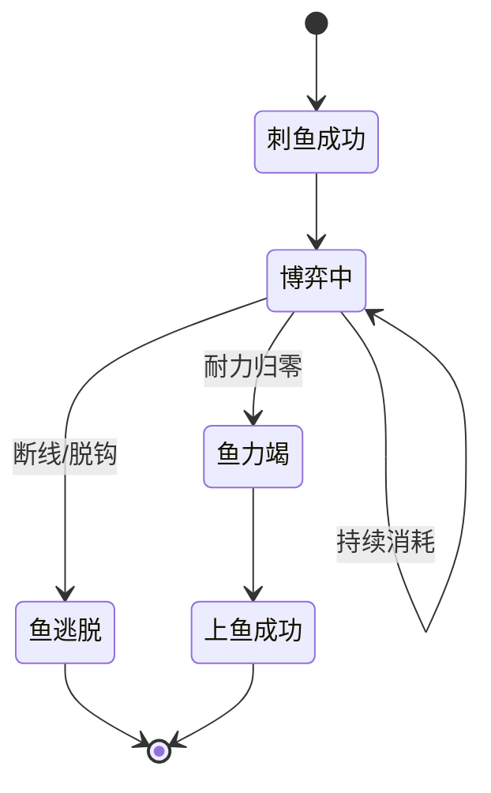
```mermaid
stateDiagram-v2
    [*] --> 刺鱼成功
    刺鱼成功 --> 博弈中
    博弈中 --> 鱼逃脱: 断线/脱钩
    博弈中 --> 鱼力竭: 耐力归零
    鱼力竭 --> 上鱼成功
    鱼逃脱 --> [*]
    上鱼成功 --> [*]
    
    博弈中 --> 博弈中: 持续消耗
```

## 2. 力学系统

### 2.1 力的传递链

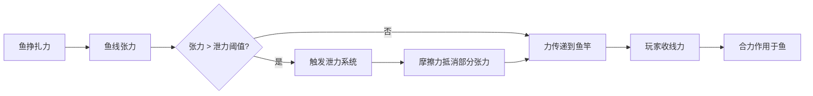
```mermaid
flowchart LR
    A[鱼挣扎力] --> B[鱼线张力]
    B --> C{张力 > 泄力阈值?}
    C -->|是| D[触发泄力系统]
    C -->|否| E[力传递到鱼竿]
    E --> F[玩家收线力]
    F --> G[合力作用于鱼]
    D --> H[摩擦力抵消部分张力]
    H --> E
```

### 2.2 单位与换算

| 物理量 | 单位 | 说明 |
|--------|------|------|
| 鱼竿承载 | kgf | 千克力，直观表达承重能力 |
| 鱼线拉力 | kgf | 与竿承载对应 |
| 泄力阈值 | kgf | 轮子参数 |
| 鱼耐力扣减 | N·s | 牛顿×时间，换算系数9.81 |
| 玩家能量消耗 | 焦耳(J) | 力×位移 |

## 3. 鱼耐力系统

### 3.1 扣减公式

```
耐力损失 = PlayerForce(N) × ΔT
```

**参数说明：**
- `PlayerForce`：玩家施加的净拉力（牛顿）
- `ΔT`：时间增量（秒）
- 耐力为**单调递减**，不回复

### 3.2 鱼种耐力配置示例

| 鱼种 | 初始耐力(N·s) | 体重(kg) | 耐力/体重比 |
|------|---------------|----------|-------------|
| 鲫鱼 | 300 | 0.5 | 600 |
| 鲤鱼 | 1500 | 3.0 | 500 |
| 草鱼 | 3000 | 5.0 | 600 |
| 青鱼 | 8000 | 15.0 | 533 |

**设计原则：**
- 大鱼耐力绝对值高，但耐力/体重比相近
- 确保大鱼博弈时长更长，但不会因体重优势无限逃脱

## 4. 泄力系统

### 4.1 动态摩擦力模型

```
当 线张力 > 泄力阈值 时：
  摩擦力 = 泄力阈值 × 动摩擦系数(0.7)
  滑出速度 = (线张力 - 摩擦力) / 线阻尼系数
```

**物理意义：**
- 泄力阈值：轮子刹车片开始滑动的临界力
- 动摩擦系数0.7：模拟刹车片与线轴的摩擦
- 线阻尼系数：水阻 + 线材内阻

### 4.2 泄力策略

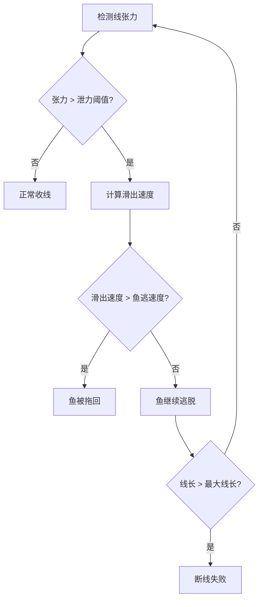
```mermaid
flowchart TD
    A[检测线张力] --> B{张力 > 泄力阈值?}
    B -->|否| C[正常收线]
    B -->|是| D[计算滑出速度]
    D --> E{滑出速度 > 鱼逃速度?}
    E -->|是| F[鱼被拖回]
    E -->|否| G[鱼继续逃脱]
    G --> H{线长 > 最大线长?}
    H -->|是| I[断线失败]
    H -->|否| A
```

**玩家决策：**
- **低泄力**：快速消耗鱼耐力，但断线风险高
- **高泄力**：安全但博弈时长增加，消耗更多体力/能量

## 5. 玩家消耗系统

### 5.1 能量与体力

```
能量消耗 = (竿能量系数 + 轮能量系数 × 传动比) × 传递到手的力 × ΔT

当能量耗尽时：
  体力扣减 = 能量缺口 / 100
```

**双层消耗设计：**
1. **能量**：快速回复（每秒+5%），短期爆发资源
2. **体力**：缓慢回复（每秒+0.5%），长期续航资源

### 5.2 装备影响

| 装备 | 影响参数 | 数值示例 |
|------|----------|----------|
| 鱼竿 | 能量系数 | 0.8-1.5 |
| 轮子 | 能量系数 | 0.5-1.2 |
| 轮子 | 传动比 | 3.5:1 - 6.2:1 |

**传动比权衡：**
- **高传动比**（6:1）：收线快，但能量消耗×1.7
- **低传动比**（3.5:1）：省力，但收线慢

## 6. 鱼AI行为

### 6.1 状态机

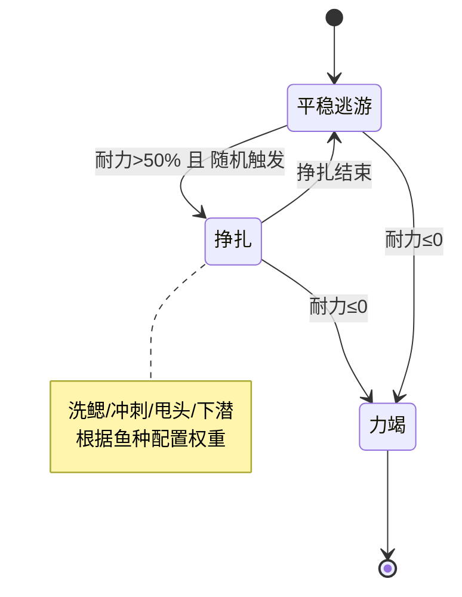
```mermaid
stateDiagram-v2
    [*] --> 平稳逃游
    平稳逃游 --> 挣扎: 耐力>50% 且 随机触发
    挣扎 --> 平稳逃游: 挣扎结束
    挣扎 --> 力竭: 耐力≤0
    平稳逃游 --> 力竭: 耐力≤0
    力竭 --> [*]
    
    note right of 挣扎
        洗鳃/冲刺/甩头/下潜
        根据鱼种配置权重
    end note
```

### 6.2 行为配置示例（JSON）

```json
{
  "鲤鱼": {
    "平稳逃游": {
      "力": "2-4 kgf",
      "持续时间": "3-8秒"
    },
    "挣扎行为": {
      "洗鳃": {"权重": 30, "力": "8-12 kgf", "时长": "1-2秒"},
      "冲刺": {"权重": 50, "力": "6-10 kgf", "时长": "2-4秒"},
      "甩头": {"权重": 20, "力": "5-8 kgf", "时长": "0.5-1秒"}
    },
    "触发条件": {
      "耐力阈值": ">50%",
      "冷却时间": "5-10秒"
    }
  }
}
```

### 6.3 力竭机制

**触发条件：** 耐力 ≤ 0

**表现：**
- 鱼翻肚漂浮
- 不再产生逃脱力
- 玩家可稳定收线

**设计目的：** 明确的胜利信号，避免无限拉锯

## 7. 断线与脱钩判定

### 7.1 断线条件

```
线张力 > 线拉力值 × 耐久度百分比
```

**耐久度影响：**
- 100%耐久：承受满额拉力
- 50%耐久：承受50%拉力
- 断线后：装备耐久度-20%，鱼逃脱

### 7.2 脱钩条件

```
当鱼挣扎时：
  脱钩概率 = 基础概率(5%) × (1 + 线松弛度/10)
```

**线松弛度：**
- 玩家收线速度 < 鱼逃脱速度时累积
- 松弛度 > 50% 时，脱钩概率显著提升

## 8. 数值平衡目标

| 鱼种 | 目标博弈时长 | 断线风险 | 体力消耗 |
|------|--------------|----------|----------|
| 小鱼(<1kg) | 30-60秒 | 低 | 10-20% |
| 中鱼(1-5kg) | 60-120秒 | 中 | 30-50% |
| 大鱼(5-15kg) | 120-300秒 | 高 | 60-90% |
| 巨物(>15kg) | 300-600秒 | 极高 | 100%+道具 |

**验证指标：**
- 胜率：60-80%（合理装备配置下）
- 断线率：<15%
- 脱钩率：<10%
- 体力耗尽率：<5%（大鱼除外）

## 鱼AI系统

# 鱼AI系统

## 1. 系统架构

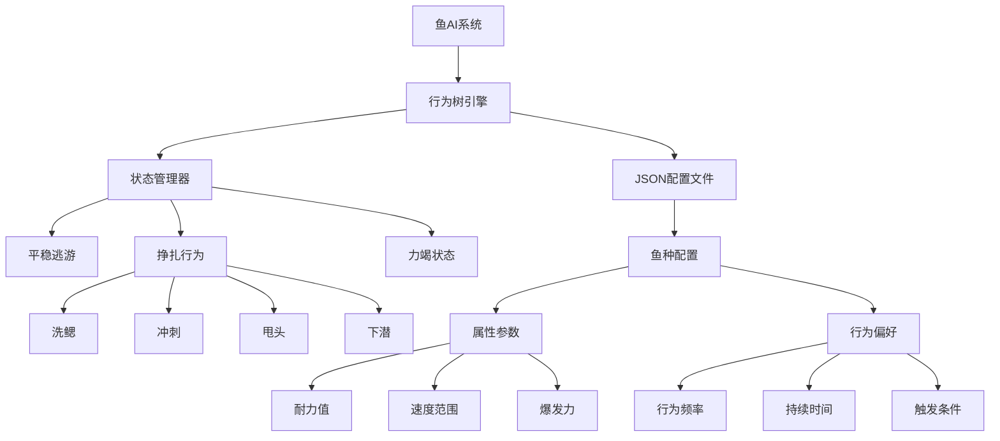
```mermaid
flowchart TB
    Start[鱼AI系统] --> BT[行为树引擎]
    BT --> Config[JSON配置文件]
    BT --> State[状态管理器]
    
    State --> S1[平稳逃游]
    State --> S2[挣扎行为]
    State --> S3[力竭状态]
    
    S2 --> B1[洗鳃]
    S2 --> B2[冲刺]
    S2 --> B3[甩头]
    S2 --> B4[下潜]
    
    Config --> Species[鱼种配置]
    Species --> Attr[属性参数]
    Species --> Behavior[行为偏好]
    
    Attr --> Stamina[耐力值]
    Attr --> Speed[速度范围]
    Attr --> Force[爆发力]
    
    Behavior --> Freq[行为频率]
    Behavior --> Duration[持续时间]
    Behavior --> Trigger[触发条件]
```

## 2. 状态机设计

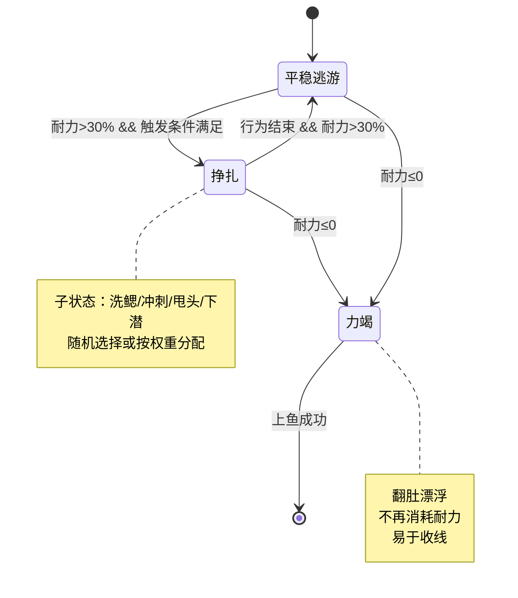
```mermaid
stateDiagram-v2
    [*] --> 平稳逃游
    
    平稳逃游 --> 挣扎: 耐力>30% && 触发条件满足
    挣扎 --> 平稳逃游: 行为结束 && 耐力>30%
    挣扎 --> 力竭: 耐力≤0
    平稳逃游 --> 力竭: 耐力≤0
    
    力竭 --> [*]: 上鱼成功
    
    note right of 挣扎
        子状态：洗鳃/冲刺/甩头/下潜
        随机选择或按权重分配
    end note
    
    note right of 力竭
        翻肚漂浮
        不再消耗耐力
        易于收线
    end note
```

## 3. 核心机制

### 3.1 耐力系统

**基础规则**
- 耐力值单调递减，不回复
- 降至0时进入力竭状态
- 不同行为消耗速率不同

**消耗公式**
```
耐力损失 = PlayerForce(N) × ΔT × 行为系数
```

**行为系数表**

| 状态 | 系数 | 说明 |
|------|------|------|
| 平稳逃游 | 1.0 | 基准消耗 |
| 洗鳃 | 1.5 | 剧烈摆动 |
| 冲刺 | 2.0 | 高速逃窜 |
| 甩头 | 1.3 | 短促发力 |
| 下潜 | 1.8 | 深水对抗 |
| 力竭 | 0 | 停止消耗 |

### 3.2 行为树配置

**JSON结构示例**
```json
{
  "fishSpecies": "bass",
  "baseStamina": 1000,
  "behaviors": {
    "calmSwim": {
      "speedRange": [0.5, 1.2],
      "forceMultiplier": 0.8,
      "duration": [3000, 8000]
    },
    "struggle": {
      "triggerConditions": {
        "staminaMin": 30,
        "tensionThreshold": 5.0,
        "cooldown": 2000
      },
      "actions": [
        {
          "type": "gillWash",
          "weight": 25,
          "speedMultiplier": 1.5,
          "duration": [1000, 2000],
          "forceMultiplier": 1.5
        },
        {
          "type": "sprint",
          "weight": 30,
          "speedMultiplier": 3.0,
          "duration": [800, 1500],
          "forceMultiplier": 2.0
        },
        {
          "type": "headShake",
          "weight": 20,
          "frequency": [3, 5],
          "duration": [500, 1000],
          "forceMultiplier": 1.3
        },
        {
          "type": "dive",
          "weight": 25,
          "depthTarget": -5,
          "duration": [2000, 4000],
          "forceMultiplier": 1.8
        }
      ]
    },
    "exhausted": {
      "floatSpeed": 0.1,
      "resistance": 0.2
    }
  }
}
```

### 3.3 行为决策流程

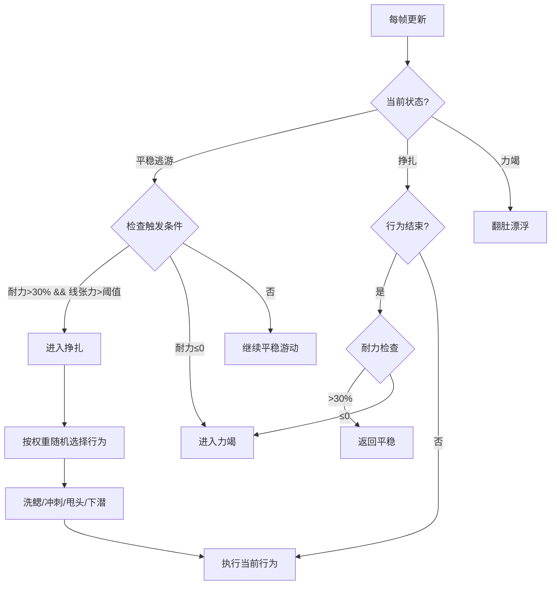
```mermaid
flowchart TD
    A[每帧更新] --> B{当前状态?}
    
    B -->|平稳逃游| C{检查触发条件}
    C -->|耐力>30% && 线张力>阈值| D[进入挣扎]
    C -->|耐力≤0| E[进入力竭]
    C -->|否| F[继续平稳游动]
    
    B -->|挣扎| G{行为结束?}
    G -->|是| H{耐力检查}
    H -->|>30%| I[返回平稳]
    H -->|≤0| E
    G -->|否| J[执行当前行为]
    
    B -->|力竭| K[翻肚漂浮]
    
    D --> L[按权重随机选择行为]
    L --> M[洗鳃/冲刺/甩头/下潜]
    M --> J
```

## 4. 鱼种差异化配置

### 4.1 配置维度

| 维度 | 说明 | 示例值 |
|------|------|--------|
| 基础耐力 | 总耐力值 | 500-3000 |
| 速度范围 | [最小, 最大] m/s | [0.5, 2.5] |
| 爆发力系数 | 挣扎时力量倍率 | 1.2-3.0 |
| 行为偏好 | 各行为权重分配 | 见下表 |
| 触发阈值 | 进入挣扎的线张力 | 3.0-8.0 kgf |
| 冷却时间 | 挣扎行为间隔 | 1000-5000 ms |

### 4.2 典型鱼种配置

**小型鱼（鲫鱼）**
- 耐力: 500
- 速度: [0.5, 1.5]
- 偏好: 甩头(40%) > 冲刺(30%) > 洗鳃(20%) > 下潜(10%)
- 特点: 频繁短促挣扎

**中型鱼（鲈鱼）**
- 耐力: 1200
- 速度: [0.8, 2.0]
- 偏好: 冲刺(30%) = 洗鳃(30%) > 下潜(25%) > 甩头(15%)
- 特点: 均衡型，持续对抗

**大型鱼（青鱼）**
- 耐力: 2500
- 速度: [0.6, 1.8]
- 偏好: 下潜(40%) > 冲刺(35%) > 洗鳃(15%) > 甩头(10%)
- 特点: 深水拉锯，耐力持久

## 5. 实现要点

### 5.1 行为执行

**洗鳃（Gill Wash）**
```
速度 = 基础速度 × 1.5
方向 = 左右摆动（正弦波）
频率 = 2-4 Hz
持续 = 1-2秒
```

**冲刺（Sprint）**
```
速度 = 基础速度 × 3.0
方向 = 远离玩家
持续 = 0.8-1.5秒
加速度 = 瞬间爆发
```

**甩头（Head Shake）**
```
角度 = ±30-60度
频率 = 3-5次/秒
持续 = 0.5-1秒
力矩 = 对鱼线施加侧向力
```

**下潜（Dive）**
```
目标深度 = 当前深度 - 5m
速度 = 基础速度 × 1.5
持续 = 2-4秒
阻力增加 = 水深系数
```

### 5.2 性能优化

- 行为树每100ms更新一次（非每帧）
- 使用对象池管理行为实例
- 预计算权重累积和，加速随机选择
- 力竭状态简化物理计算

### 5.3 调试工具

**可视化面板**
- 当前状态显示
- 耐力条实时更新
- 行为历史记录
- 触发条件监控

**快捷键**
- `F1`: 强制进入挣扎
- `F2`: 清空耐力（测试力竭）
- `F3`: 重置AI状态
- `F4`: 切换行为树可视化

## 6. 数值验证目标

- [ ] 不同鱼种耐力消耗曲线合理
- [ ] 挣扎行为触发频率符合预期
- [ ] 力竭时机与装备匹配度适中
- [ ] 行为多样性避免单调重复
- [ ] 大鱼不会比小鱼更快上钩

## 数值体系

# 数值体系

## 1. 核心数值框架

### 1.1 力学单位系统

| 物理量 | 单位 | 应用场景 | 换算关系 |
|--------|------|----------|----------|
| 拉力/承载 | kgf (千克力) | 装备属性、鱼重量 | 1 kgf = 9.81 N |
| 力的传递 | N (牛顿) | 耐力扣减计算 | - |
| 时间 | 秒 (s) | 物理模拟步长 | ΔT = 0.016s (60fps) |
| 距离 | 米 (m) | 鱼线长度、鱼移动 | - |

### 1.2 数值流转架构

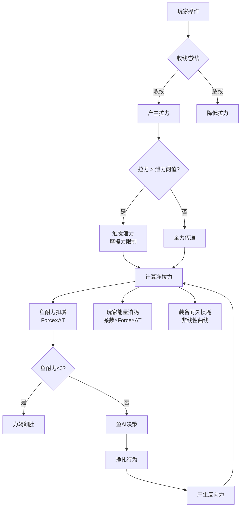
```mermaid
flowchart TB
    A[玩家操作] --> B{收线/放线}
    B -->|收线| C[产生拉力]
    B -->|放线| D[降低拉力]
    
    C --> E{拉力 > 泄力阈值?}
    E -->|是| F[触发泄力<br/>摩擦力限制]
    E -->|否| G[全力传递]
    
    F --> H[计算净拉力]
    G --> H
    
    H --> I[鱼耐力扣减<br/>Force×ΔT]
    H --> J[玩家能量消耗<br/>系数×Force×ΔT]
    H --> K[装备耐久损耗<br/>非线性曲线]
    
    I --> L{鱼耐力≤0?}
    L -->|是| M[力竭翻肚]
    L -->|否| N[鱼AI决策]
    
    N --> O[挣扎行为]
    O --> P[产生反向力]
    P --> H
```

## 2. 装备数值设计

### 2.1 鱼竿属性表

| 等级 | 名称 | 承载上限(kgf) | 硬度系数 | 能量消耗系数 | 耐久上限 | 价格 |
|------|------|---------------|----------|--------------|----------|------|
| 1 | 新手竹竿 | 3 | 0.5 | 1.2 | 100 | 0 |
| 2 | 玻璃钢竿 | 5 | 0.7 | 1.0 | 150 | 500 |
| 3 | 碳素竿 | 8 | 0.85 | 0.85 | 200 | 2000 |
| 4 | 高碳竿 | 12 | 0.95 | 0.7 | 300 | 8000 |
| 5 | 竞技竿 | 18 | 1.0 | 0.6 | 500 | 30000 |

**硬度系数说明**：影响竿身弯曲程度，0.5=软调（大弧度），1.0=硬调（小弧度）

### 2.2 渔轮属性表

| 等级 | 名称 | 传动比 | 泄力上限(kgf) | 能量消耗系数 | 耐久上限 | 价格 |
|------|------|--------|---------------|--------------|----------|------|
| 1 | 塑料轮 | 3.5:1 | 2 | 1.3 | 80 | 0 |
| 2 | 铝合金轮 | 4.5:1 | 4 | 1.1 | 120 | 800 |
| 3 | 精密轮 | 5.5:1 | 7 | 0.9 | 180 | 3500 |
| 4 | 竞速轮 | 6.5:1 | 10 | 0.75 | 250 | 12000 |
| 5 | 大师轮 | 7.5:1 | 15 | 0.6 | 400 | 50000 |

**传动比说明**：影响收线速度和力的放大，高传动比=快速收线但费力

### 2.3 鱼线属性表

| 等级 | 名称 | 拉力值(kgf) | 线径(mm) | 水阻系数 | 耐久上限 | 价格(100m) |
|------|------|-------------|----------|----------|----------|------------|
| 1 | 尼龙线 | 2 | 0.3 | 1.0 | 50 | 0 |
| 2 | 碳素线 | 4 | 0.25 | 0.85 | 80 | 300 |
| 3 | PE线 | 6 | 0.2 | 0.7 | 120 | 1200 |
| 4 | 高强PE | 10 | 0.18 | 0.6 | 180 | 5000 |
| 5 | 竞技线 | 15 | 0.15 | 0.5 | 300 | 20000 |

**水阻系数说明**：影响鱼线在水中的阻力，细线=低阻力=鱼更难察觉

## 3. 鱼种数值设计

### 3.1 鱼种基础属性

| 鱼种 | 重量范围(kg) | 基础耐力 | 爆发力(kgf) | 持续力(kgf) | 售价/kg | 稀有度 |
|------|--------------|----------|-------------|-------------|---------|--------|
| 鲫鱼 | 0.2-0.5 | 50 | 1.5 | 0.8 | 20 | ★ |
| 鲤鱼 | 1-3 | 120 | 3.5 | 2.0 | 35 | ★★ |
| 草鱼 | 2-5 | 200 | 5.0 | 3.5 | 40 | ★★ |
| 青鱼 | 5-15 | 500 | 12.0 | 8.0 | 60 | ★★★ |
| 鲢鱼 | 3-8 | 300 | 8.0 | 5.0 | 45 | ★★ |
| 黑鱼 | 2-6 | 350 | 9.0 | 6.0 | 80 | ★★★ |
| 鲈鱼 | 1-4 | 250 | 6.0 | 4.0 | 100 | ★★★ |
| 鳡鱼 | 10-30 | 800 | 20.0 | 15.0 | 120 | ★★★★ |

**耐力计算公式**：
```
实际耐力 = 基础耐力 × (1 + 重量系数)
重量系数 = (实际重量 - 最小重量) / (最大重量 - 最小重量) × 0.5
```

### 3.2 鱼AI行为权重

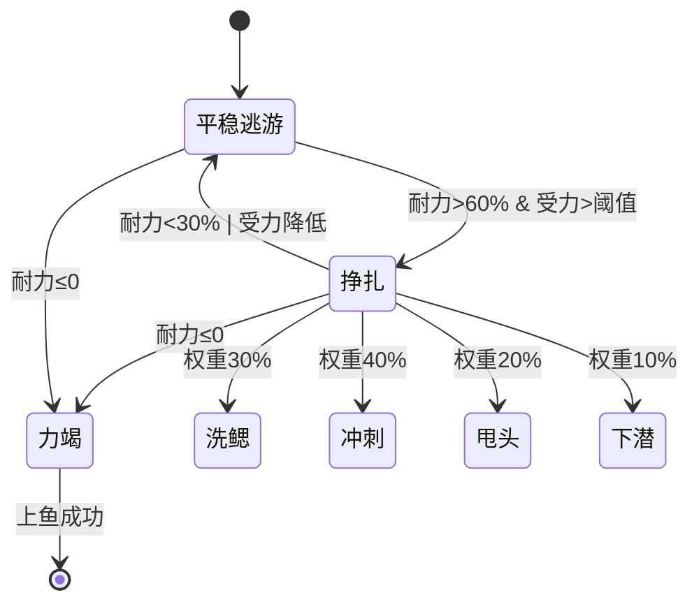
```mermaid
stateDiagram-v2
    [*] --> 平稳逃游
    平稳逃游 --> 挣扎: 耐力>60% & 受力>阈值
    挣扎 --> 平稳逃游: 耐力<30% | 受力降低
    挣扎 --> 力竭: 耐力≤0
    平稳逃游 --> 力竭: 耐力≤0
    力竭 --> [*]: 上鱼成功
    
    挣扎 --> 洗鳃: 权重30%
    挣扎 --> 冲刺: 权重40%
    挣扎 --> 甩头: 权重20%
    挣扎 --> 下潜: 权重10%
```

**行为参数表**：

| 行为 | 力度倍率 | 持续时间(s) | 耐力消耗倍率 | 触发条件 |
|------|----------|-------------|--------------|----------|
| 平稳逃游 | 1.0× | 持续 | 1.0× | 默认状态 |
| 洗鳃 | 1.8× | 2-4 | 2.5× | 耐力>50% |
| 冲刺 | 2.5× | 1-2 | 3.0× | 耐力>40% |
| 甩头 | 1.5× | 0.5-1 | 1.8× | 任意耐力 |
| 下潜 | 2.0× | 3-5 | 2.2× | 耐力>60% & 深水区 |
| 力竭翻肚 | 0.2× | 持续 | 0× | 耐力≤0 |

## 4. 博鱼核心公式

### 4.1 耐力扣减系统

```
净拉力(N) = 玩家施加力(N) - 泄力摩擦力(N)

鱼耐力损失 = 净拉力(N) × ΔT(s) × 鱼种系数

鱼种系数示例：
- 鲫鱼/鲤鱼：1.2 (易疲劳)
- 草鱼/青鱼：1.0 (标准)
- 黑鱼/鲈鱼：0.8 (耐力强)
```

### 4.2 泄力系统

```
IF 线张力 > 泄力阈值:
    摩擦力 = 泄力阈值 × 动摩擦系数(0.7)
    滑出速度 = (线张力 - 摩擦力) / 线阻尼系数(50)
    放线长度 = 滑出速度 × ΔT
ELSE:
    摩擦力 = 线张力 (静摩擦)
    放线长度 = 0
```

### 4.3 玩家消耗

```
传递到手的力(kgf) = 线张力(kgf) / 传动比

能量消耗 = (竿能量系数 + 轮能量系数 × 传动比) × 传递到手的力(kgf) × ΔT

IF 能量 > 0:
    扣除能量
ELSE:
    扣除体力 = 能量缺口 / 100
```

### 4.4 装备耐久损耗

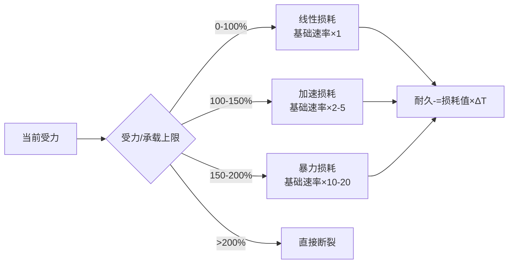
```mermaid
graph LR
    A[当前受力] --> B{受力/承载上限}
    B -->|0-100%| C[线性损耗<br/>基础速率×1]
    B -->|100-150%| D[加速损耗<br/>基础速率×2-5]
    B -->|150-200%| E[暴力损耗<br/>基础速率×10-20]
    B -->|>200%| F[直接断裂]
    
    C --> G[耐久-=损耗值×ΔT]
    D --> G
    E --> G
```

**损耗公式**：
```
受力比 = 当前受力 / 装备承载上限

IF 受力比 ≤ 1.0:
    损耗倍率 = 1.0
ELSE IF 受力比 ≤ 1.5:
    损耗倍率 = 2 + (受力比 - 1.0) × 6  // 2-5倍
ELSE IF 受力比 ≤ 2.0:
    损耗倍率 = 10 + (受力比 - 1.5) × 20  // 10-20倍
ELSE:
    装备断裂

耐久损耗 = 基础损耗速率 × 损耗倍率 × ΔT + 时间衰减(0.01/小时)
```

## 5. 经济循环

### 5.1 收益模型

**卖鱼收益**：
```
单条鱼收益 = 鱼种单价/kg × 实际重量(kg) × 品质系数

品质系数：
- 完美(耐久>80%): 1.2×
- 良好(耐久50-80%): 1.0×
- 一般(耐久20-50%): 0.8×
- 破损(耐久<20%): 0.5×
```

**任务奖励**：
- 日常任务：100-500金币
- 周常任务：1000-3000金币
- 成就奖励：500-10000金币

### 5.2 消耗模型

| 消耗项 | 金额范围 | 触发条件 |
|--------|----------|----------|
| 购买装备 | 500-50000 | 主动购买 |
| 升级装备 | 当前价格×0.3 | 主动升级 |
| 维修钓具 | 最大耐久×5 | 耐久<50% |
| 补充体力 | 50/次 | 体力<20% |
| 解锁钓场 | 1000-20000 | 进度解锁 |
| 补充饵料 | 10-100/组 | 饵料耗尽 |

### 5.3 平衡目标

```
单小时期望收益 = 800-1200金币 (新手装备)
单小时期望收益 = 2000-3500金币 (中级装备)
单小时期望收益 = 5000-8000金币 (高级装备)

装备回本周期 = 装备价格 / (期望收益 - 维修成本) ≈ 3-5小时
```

## 6. 数值验证指标

### 6.1 心流体验指标

| 指标 | 目标值 | 测量方法 |
|------|--------|----------|
| 单次博鱼时长 | 30-90秒 | 咬钩到上鱼的平均时间 |
| 成功率 | 70-85% | 咬钩后成功上鱼比例 |
| 装备损耗率 | 5-10%/小时 | 耐久度下降速度 |
| 收益波动 | ±30% | 单小时收益标准差 |

### 6.2 数值异常检测

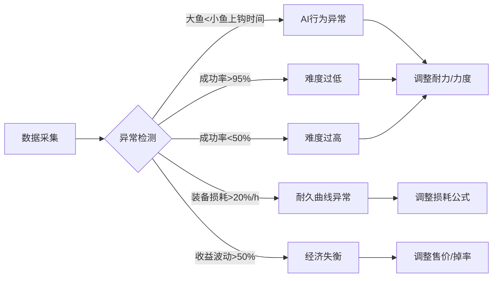
```mermaid
flowchart LR
    A[数据采集] --> B{异常检测}
    B -->|大鱼<小鱼上钩时间| C[AI行为异常]
    B -->|成功率>95%| D[难度过低]
    B -->|成功率<50%| E[难度过高]
    B -->|装备损耗>20%/h| F[耐久曲线异常]
    B -->|收益波动>50%| G[经济失衡]
    
    C --> H[调整耐力/力度]
    D --> H
    E --> H
    F --> I[调整损耗公式]
    G --> J[调整售价/掉率]
```

### 6.3 A/B测试方案

**测试维度**：
1. 泄力摩擦系数：0.6 vs 0.7 vs 0.8
2. 鱼耐力基数：±20%
3. 装备损耗曲线：线性 vs 非线性
4. 经济倍率：售价±30%

**评估标准**：
- 玩家留存时长 > 30分钟
- 装备升级意愿 > 60%
- 重复游玩率 > 40%

---

**数值迭代原则**：
1. 优先保证心流体验（博鱼时长、成功率）
2. 其次平衡经济循环（收益-消耗比）
3. 最后优化装备差异化（明显的性能提升）

## 装备系统

# 装备系统

## 1. 系统概述

装备系统是钓鱼游戏的核心数值支撑，通过鱼竿、渔轮、鱼线、鱼饵四大类装备的组合，实现不同鱼种的针对性配置和玩家成长曲线。装备属性直接影响博鱼体验、经济消耗和策略深度。

## 2. 装备分类与属性

### 2.1 鱼竿（Rod）

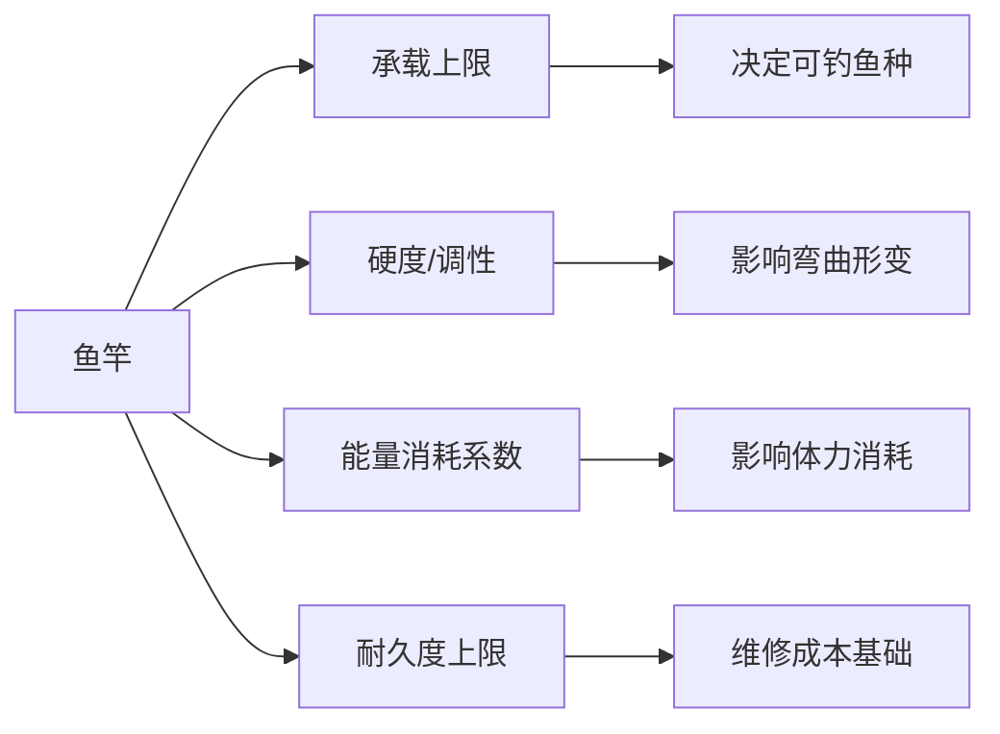
```mermaid
graph LR
    A[鱼竿] --> B[承载上限]
    A --> C[硬度/调性]
    A --> D[能量消耗系数]
    A --> E[耐久度上限]
    
    B --> B1[决定可钓鱼种]
    C --> C1[影响弯曲形变]
    D --> D1[影响体力消耗]
    E --> E1[维修成本基础]
```

**核心属性**

| 属性 | 单位 | 作用 | 数值范围示例 |
|------|------|------|--------------|
| 承载上限 | kgf | 超过此值触发断竿风险 | 5-50 kgf |
| 硬度系数 | 无量纲 | 影响竿身弯曲程度（0.3=软竿，1.0=硬竿） | 0.3-1.0 |
| 调性 | 枚举 | 弯曲点位置（先调/中调/后调） | 3/5/7调 |
| 能量消耗系数 | 无量纲 | 玩家收线时的能量消耗倍率 | 0.8-1.5 |
| 耐久度上限 | 点数 | 初始耐久值 | 100-500 |

**分级示例**

- **入门竿**：承载10kgf，硬度0.5，能量系数1.2，耐久200
- **进阶竿**：承载25kgf，硬度0.7，能量系数1.0，耐久350
- **专业竿**：承载50kgf，硬度0.9，能量系数0.85，耐久500

### 2.2 渔轮（Reel）

**核心属性**

| 属性 | 单位 | 作用 | 数值范围示例 |
|------|------|------|--------------|
| 传动比 | 比值 | 每转手柄收线长度（如5.2:1） | 3.0:1 - 7.0:1 |
| 泄力上限 | kgf | 最大可设置的泄力阈值 | 3-30 kgf |
| 能量消耗系数 | 无量纲 | 与传动比联动影响体力消耗 | 0.7-1.3 |
| 耐久度上限 | 点数 | 初始耐久值 | 150-600 |

**传动比策略**

- **低速轮（3.0:1-4.5:1）**：适合大鱼，力量大但收线慢，能量消耗低
- **平衡轮（4.6:1-5.5:1）**：通用型，中等速度和力量
- **高速轮（5.6:1-7.0:1）**：适合小鱼，收线快但能量消耗高

### 2.3 鱼线（Line）

**核心属性**

| 属性 | 单位 | 作用 | 数值范围示例 |
|------|------|------|--------------|
| 拉力值 | kgf | 超过此值触发断线风险 | 2-40 kgf |
| 线径 | mm | 影响水阻系数（线径越大水阻越大） | 0.1-0.8 mm |
| 耐久度 | 点数 | 磨损后降低拉力值 | 50-300 |

**水阻计算**

```
水阻力 = 基础水阻系数 × 线径² × 相对速度
```

**线径权衡**

- **细线（0.1-0.3mm）**：拉力低但水阻小，适合小鱼和技巧流
- **粗线（0.4-0.8mm）**：拉力高但水阻大，适合大鱼和暴力流

### 2.4 鱼饵（Bait）

**核心属性**

| 属性 | 单位 | 作用 | 数值范围示例 |
|------|------|------|--------------|
| 吸引力 | 点数 | 影响诱鱼速度和咬钩概率 | 10-100 |
| 目标鱼种 | 标签 | 特定鱼种吸引力加成 | 草鱼+50%/鲤鱼+30% |
| 消耗模式 | 枚举 | 一次性/多次使用 | 1次/5次/10次 |

## 3. 装备组合与匹配

### 3.1 匹配规则

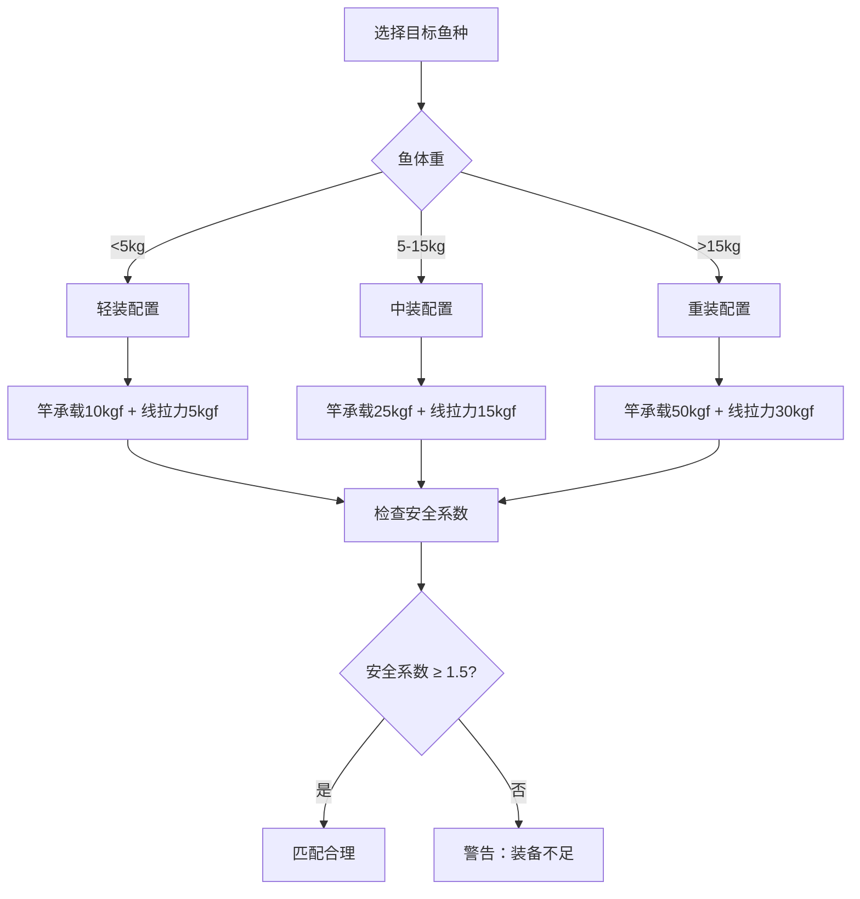
```mermaid
flowchart TD
    A[选择目标鱼种] --> B{鱼体重}
    B -->|<5kg| C[轻装配置]
    B -->|5-15kg| D[中装配置]
    B -->|>15kg| E[重装配置]
    
    C --> C1[竿承载10kgf + 线拉力5kgf]
    D --> D1[竿承载25kgf + 线拉力15kgf]
    E --> E1[竿承载50kgf + 线拉力30kgf]
    
    C1 --> F[检查安全系数]
    D1 --> F
    E1 --> F
    
    F --> G{安全系数 ≥ 1.5?}
    G -->|是| H[匹配合理]
    G -->|否| I[警告：装备不足]
```

**安全系数公式**

```
安全系数 = min(竿承载上限, 线拉力值, 轮泄力上限) / 目标鱼最大拉力
```

建议安全系数：
- **1.5-2.0**：合理配置，有容错空间
- **1.0-1.5**：极限配置，需精细操作
- **<1.0**：装备不足，高断线/断竿风险

### 3.2 配置示例

**新手套装（目标：草鱼3kg）**
- 竿：承载10kgf，硬度0.5
- 轮：传动比5.0:1，泄力上限5kgf
- 线：拉力值5kgf，线径0.2mm
- 饵：草鱼专用饵，吸引力30
- 安全系数：5kgf / (3kg × 1.5) ≈ 1.67 ✓

**进阶套装（目标：鲤鱼10kg）**
- 竿：承载25kgf，硬度0.7
- 轮：传动比4.5:1，泄力上限15kgf
- 线：拉力值15kgf，线径0.4mm
- 饵：鲤鱼专用饵，吸引力60
- 安全系数：15kgf / (10kg × 2.0) ≈ 1.5 ✓

**专业套装（目标：青鱼30kg）**
- 竿：承载50kgf，硬度0.9
- 轮：传动比3.5:1，泄力上限30kgf
- 线：拉力值30kgf，线径0.6mm
- 饵：青鱼专用饵，吸引力90
- 安全系数：30kgf / (30kg × 2.5) ≈ 1.2（极限配置）

## 4. 耐久度系统

### 4.1 损耗机制

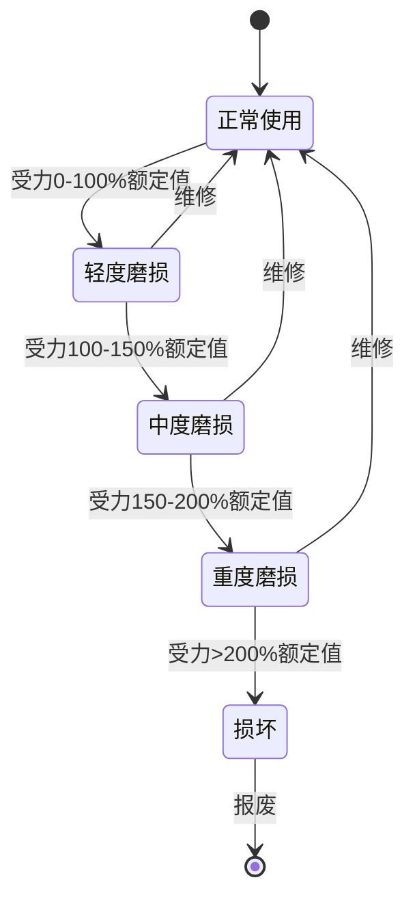
```mermaid
stateDiagram-v2
    [*] --> 正常使用
    正常使用 --> 轻度磨损: 受力0-100%额定值
    轻度磨损 --> 中度磨损: 受力100-150%额定值
    中度磨损 --> 重度磨损: 受力150-200%额定值
    重度磨损 --> 损坏: 受力>200%额定值
    
    轻度磨损 --> 正常使用: 维修
    中度磨损 --> 正常使用: 维修
    重度磨损 --> 正常使用: 维修
    损坏 --> [*]: 报废
```

**损耗公式**

```
每秒耐久损失 = 基础时间衰减 + 受力损耗

受力损耗 = {
  受力比率 ≤ 100%:  受力比率 × 0.01
  100% < 受力比率 ≤ 150%:  (受力比率 - 100) × 0.02-0.05
  150% < 受力比率 ≤ 200%:  (受力比率 - 150) × 0.1-0.2
  受力比率 > 200%:  直接断裂
}

受力比率 = 当前受力 / 装备额定值 × 100%
```

**示例计算**

鱼线拉力值15kgf，当前张力18kgf：
- 受力比率 = 18/15 × 100% = 120%
- 受力损耗 = (120-100) × 0.03 = 0.6点/秒
- 若持续10秒，损失6点耐久

### 4.2 维修成本

| 耐久度区间 | 维修费用 | 维修时间 |
|------------|----------|----------|
| 80-100% | 装备价值×5% | 即时 |
| 50-79% | 装备价值×15% | 即时 |
| 20-49% | 装备价值×35% | 即时 |
| 1-19% | 装备价值×60% | 即时 |
| 0% | 无法维修，需重新购买 | - |

**耐久度影响**

- **鱼竿**：耐久<50%时承载上限降低20%
- **渔轮**：耐久<50%时泄力精度下降（±10%波动）
- **鱼线**：耐久每降低10%，拉力值降低5%

## 5. 装备升级路径

### 5.1 升级树结构

```mermaid
graph TD
    A[新手竿 10kgf] --> B[进阶竿 25kgf]
    B --> C[专业竿 50kgf]
    
    A1[基础轮 5kgf] --> B1[中级轮 15kgf]
    B1 --> C1[高级轮 30kgf]
    
    A2[尼龙线 5kgf] --> B2[碳素线 15kgf]
    B2 --> C2[PE线 30kgf]
    
    style A fill:#90EE90
    style A1 fill:#90EE90
    style A2 fill:#90EE90
    style C fill:#FFD700
    style C1 fill:#FFD700
    style C2 fill:#FFD700
```

### 5.2 解锁条件

| 装备等级 | 解锁条件 | 购买价格 |
|----------|----------|----------|
| 新手装备 | 初始可用 | 500-1000金币 |
| 进阶装备 | 玩家等级5 + 累计钓鱼20条 | 3000-5000金币 |
| 专业装备 | 玩家等级15 + 钓获10kg以上鱼类 | 10000-20000金币 |

### 5.3 装备强化（可选）

**强化系统**（如需更深度养成）

- **+1至+5**：提升装备属性5%-25%
- **强化材料**：通过钓鱼获得的特殊材料
- **失败机制**：强化失败装备不损坏，材料消耗

## 6. UI展示需求

### 6.1 装备面板

**必要信息**
- 装备图标 + 名称
- 核心属性（承载/拉力/传动比等）
- 当前耐久度（进度条 + 百分比）
- 装备等级/稀有度标识

**交互功能**
- 点击查看详细属性
- 拖拽更换装备
- 一键推荐配置（根据目标鱼种）

### 6.2 实时状态显示

**博鱼过程中显示**
- 当前线张力 / 线拉力值（如：12.5 / 15 kgf）
- 竿承载状态（颜色预警：绿色安全/黄色警告/红色危险）
- 耐久度实时损耗提示

## 7. 数值平衡要点

1. **装备差距控制**：高级装备属性为低级装备的3-5倍，避免过度碾压
2. **经济循环**：维修成本占钓鱼收益的10-20%，保持经济压力
3. **策略深度**：同等级装备提供不同流派选择（速度流/力量流/平衡流）
4. **容错空间**：新手装备安全系数≥2.0，降低挫败感
5. **成长激励**：每次装备升级带来明显的体验提升（钓鱼时间缩短30%+）

## 经济循环

# 经济循环

## 1. 系统概述

经济循环是钓鱼游戏的核心驱动力，通过**收益-消耗-成长**的闭环，引导玩家持续体验不同鱼种、装备和钓场。本系统设计目标：

- **正反馈循环**：钓到更大的鱼 → 获得更多金币 → 购买更好装备 → 挑战更强鱼种
- **风险收益平衡**：高收益鱼种需要高级装备，装备损耗成本与收益成正比
- **长期目标**：通过图鉴、成就、排行榜提供持续动力

```mermaid
flowchart LR
    A[钓鱼活动] -->|卖鱼收益| B[金币获取]
    A -->|装备损耗| C[金币消耗]
    B --> D[购买/升级装备]
    D --> E[挑战更高价值鱼种]
    E --> A
    
    F[任务/成就] -->|奖励| B
    G[排行榜] -->|奖励| B
    
    C --> H[维修装备]
    C --> I[补充消耗品]
    C --> J[解锁钓场]
    
    style A fill:#e1f5ff
    style B fill:#d4edda
    style C fill:#f8d7da
```

## 2. 收益来源

### 2.1 卖鱼收益（主要来源）

**基础公式**：
```
卖鱼价格 = 鱼种基础价 × 重量系数 × 品质系数 × 稀有度系数
```

**参数设计**：

| 鱼种 | 基础价(金币/kg) | 重量范围(kg) | 稀有度系数 | 示例收益 |
|------|----------------|-------------|-----------|---------|
| 鲫鱼 | 10 | 0.2-0.5 | 1.0 | 2-5金币 |
| 鲤鱼 | 15 | 1-5 | 1.2 | 18-90金币 |
| 草鱼 | 12 | 2-8 | 1.0 | 24-96金币 |
| 青鱼 | 20 | 5-20 | 1.5 | 150-600金币 |
| 鲢鱼 | 8 | 3-10 | 0.8 | 19-64金币 |
| 黑鱼 | 35 | 2-8 | 2.0 | 140-560金币 |
| 鲈鱼 | 40 | 1-5 | 2.5 | 100-500金币 |

**品质系数**（基于博鱼表现）：
- 完美（无断线/无超载）：1.5x
- 优秀（轻微超载<120%）：1.2x
- 良好（中度超载<150%）：1.0x
- 普通（重度超载<200%）：0.8x

### 2.2 任务奖励

**每日任务**（3个/天，刷新时间：00:00）：
- 钓获任意鱼×5：50金币
- 钓获指定鱼种×3：100金币
- 累计钓鱼时长30分钟：80金币

**周常任务**（5个/周，刷新时间：周一00:00）：
- 钓获稀有鱼×3：500金币
- 完成10次完美博鱼：300金币
- 累计收益达5000金币：800金币

### 2.3 成就/图鉴奖励

**图鉴系统**：
- 首次钓获新鱼种：50-500金币（按稀有度）
- 完成区域图鉴（如淡水鱼10种）：1000金币
- 全图鉴完成：5000金币

**成就系统**：
- 钓鱼大师（累计钓鱼100次）：200金币
- 巨物猎人（钓获10kg+鱼×5）：500金币
- 装备收藏家（拥有全套高级装备）：1000金币

### 2.4 排行榜奖励

**周榜**（每周一结算）：
- 第1名：2000金币
- 第2-3名：1000金币
- 第4-10名：500金币

**排行维度**：
- 单次最大鱼重量
- 周累计收益
- 完美博鱼次数

## 3. 消耗项

### 3.1 装备购买/升级

**鱼竿**：

| 等级 | 名称 | 承载上限(kgf) | 价格(金币) | 解锁条件 |
|------|------|--------------|-----------|---------|
| 1 | 新手竹竿 | 3 | 0（初始） | - |
| 2 | 玻璃钢竿 | 5 | 500 | 钓获50次 |
| 3 | 碳素竿 | 8 | 2000 | 钓获200次 |
| 4 | 高碳竿 | 12 | 5000 | 钓获10kg+鱼×3 |
| 5 | 大物竿 | 20 | 15000 | 完成青鱼图鉴 |

**轮子**：

| 等级 | 名称 | 传动比 | 泄力上限(kgf) | 价格(金币) |
|------|------|--------|--------------|-----------|
| 1 | 塑料轮 | 3.5:1 | 2 | 0（初始） |
| 2 | 铝合金轮 | 4.5:1 | 4 | 800 |
| 3 | 金属轮 | 5.5:1 | 6 | 3000 |
| 4 | 精密轮 | 6.5:1 | 10 | 8000 |

**鱼线**：

| 等级 | 名称 | 拉力值(kgf) | 线径(mm) | 价格(金币/100m) |
|------|------|------------|---------|----------------|
| 1 | 尼龙线 | 3 | 0.3 | 50 |
| 2 | 碳线 | 5 | 0.28 | 150 |
| 3 | PE线 | 8 | 0.25 | 400 |
| 4 | 高强PE | 12 | 0.23 | 1000 |

**饵料**：

| 类型 | 吸引鱼种 | 持续时间 | 价格(金币/10个) |
|------|---------|---------|----------------|
| 蚯蚓 | 鲫鱼/鲤鱼 | 5分钟 | 20 |
| 玉米 | 草鱼/鲢鱼 | 8分钟 | 30 |
| 小鱼 | 黑鱼/鲈鱼 | 3分钟 | 80 |
| 特效饵 | 全鱼种 | 10分钟 | 200 |

### 3.2 维修成本

**耐久度机制**：
- 装备初始耐久度：100%
- 耐久度<50%：属性衰减（线性，50%耐久=75%属性）
- 耐久度=0：装备损坏，无法使用

**损耗计算**：
```
单次损耗 = 基础损耗 × 受力惩罚系数 × 时间系数

受力惩罚系数：
- 0-100%承载：1.0
- 100-150%：2-5倍（线性插值）
- 150-200%：10-20倍（线性插值）
- >200%：直接断裂
```

**维修价格**：
```
维修费用 = 装备购买价 × (1 - 当前耐久度%) × 0.3
```

**示例**：
- 碳素竿（2000金币）从100%降至50%，维修费=2000×0.5×0.3=300金币
- 高碳竿（5000金币）从80%降至20%，维修费=5000×0.6×0.3=900金币

### 3.3 其他消耗

**体力补充**：
- 体力上限：100点
- 自然恢复：6点/小时（离线也恢复）
- 快速恢复：50金币=50体力（每日限购5次）

**钓场解锁**：
- 城市公园：免费（初始）
- 郊外水库：500金币
- 山区湖泊：2000金币
- 深海区域：10000金币

**饵料补充**：
- 按上表价格购买
- 每次钓鱼消耗1个饵料

## 4. 平衡性设计

### 4.1 收支平衡表（单小时）

| 玩家阶段 | 主要鱼种 | 平均收益 | 维修成本 | 饵料成本 | 净收益 | 升级目标 |
|---------|---------|---------|---------|---------|--------|---------|
| 新手期 | 鲫鱼/鲤鱼 | 200 | 20 | 40 | 140 | 玻璃钢竿(500) |
| 成长期 | 草鱼/青鱼 | 800 | 100 | 60 | 640 | 碳素竿(2000) |
| 进阶期 | 黑鱼/鲈鱼 | 2000 | 300 | 160 | 1540 | 高碳竿(5000) |
| 大师期 | 青鱼/巨物 | 5000 | 800 | 200 | 4000 | 精密轮(8000) |

### 4.2 装备投资回报周期

```mermaid
flowchart TD
    A[新手竹竿] -->|3.6小时| B[玻璃钢竿 500金币]
    B -->|3.1小时| C[碳素竿 2000金币]
    C -->|3.2小时| D[高碳竿 5000金币]
    D -->|3.8小时| E[大物竿 15000金币]
    
    style A fill:#f0f0f0
    style B fill:#d4edda
    style C fill:#cfe2ff
    style D fill:#fff3cd
    style E fill:#f8d7da
```

**设计原则**：
- 每次装备升级的回报周期控制在3-4小时
- 确保玩家在当前装备下能稳定盈利
- 高级装备解锁需要技术门槛（如完成特定成就）

### 4.3 风险收益曲线

**保守玩法**（低风险低收益）：
- 使用80%承载上限以下的装备
- 维修成本低（基础损耗×1.0）
- 小时净收益：阶段平均值×0.8

**激进玩法**（高风险高收益）：
- 挑战100-150%承载上限的鱼
- 维修成本高（基础损耗×2-5倍）
- 成功时收益×1.5（品质加成）
- 失败时损失装备耐久度20-50%

**期望收益对比**：
```
保守玩法：140×0.8 = 112金币/小时（稳定）
激进玩法：140×1.5×0.6（成功率） - 300（平均维修） = -174金币/小时（新手期不推荐）
激进玩法：2000×1.5×0.8（成功率） - 500（平均维修） = 1900金币/小时（进阶期推荐）
```

## 5. 长期激励机制

### 5.1 成就系统

**进度型成就**：
- 钓鱼次数里程碑：10/50/100/500/1000次
- 累计收益里程碑：1000/5000/10000/50000金币
- 装备升级里程碑：拥有3/5/8件高级装备

**挑战型成就**：
- 完美博鱼连胜：3/5/10次
- 单次钓获巨物：5kg/10kg/20kg
- 无维修通关：连续钓鱼50次不维修

### 5.2 图鉴收集

**完成度奖励**：
- 25%图鉴：500金币 + 特效饵×5
- 50%图鉴：1500金币 + 高级鱼竿优惠券
- 75%图鉴：3000金币 + 永久饵料折扣10%
- 100%图鉴：5000金币 + 传说装备解锁

### 5.3 排行榜竞争

**赛季机制**（每月重置）：
- 月度总收益榜
- 月度巨物榜
- 月度完美博鱼榜

**赛季奖励**：
- 前10名：专属称号 + 金币奖励
- 前100名：稀有饵料礼包
- 参与奖：经验加成buff（下赛季+10%收益）

## 6. 数值验证目标

通过Demo模拟验证以下指标：

1. **新手留存**：前30分钟能否顺利完成首次装备升级
2. **中期成长**：2-5小时游戏时长的收益曲线是否平滑
3. **长期动力**：10小时+玩家是否仍有明确升级目标
4. **经济健康度**：通货膨胀率<5%/周，玩家平均存款在合理区间

**关键监控数据**：
- 每小时净收益分布（P50/P90）
- 装备升级时间间隔
- 维修成本占收益比例（目标：15-25%）
- 饵料成本占收益比例（目标：5-10%）

## 技术实现方案

# 技术实现方案

## 1. 技术栈选型

### 1.1 核心框架

| 技术 | 版本 | 用途 | 选型理由 |
|------|------|------|----------|
| React | 18+ | UI框架 | 组件化开发，状态管理清晰 |
| Phaser 3 | 3.70+ | 游戏引擎 | 2D渲染性能优秀，Matter.js集成 |
| Matter.js | 0.19+ | 物理引擎 | Verlet积分，适合柔体模拟 |
| TypeScript | 5.0+ | 开发语言 | 类型安全，降低数值配置错误 |

### 1.2 开发工具链

```
Vite (构建工具) + ESLint + Prettier
JSON Schema (数值配置验证)
Chart.js (数据可视化)
```

## 2. 架构设计

### 2.1 系统架构

```mermaid
flowchart TB
    subgraph UI["React UI层"]
        Control[控制面板]
        Stats[实时统计]
        Config[配置编辑器]
    end
    
    subgraph Game["Phaser游戏层"]
        Scene[钓鱼场景]
        Render[渲染系统]
    end
    
    subgraph Core["核心逻辑层"]
        Physics[物理系统]
        AI[鱼AI系统]
        Economy[经济系统]
        Equipment[装备系统]
    end
    
    subgraph Data["数据层"]
        Config2[JSON配置]
        State[状态管理]
        Logger[数据记录]
    end
    
    UI --> Game
    Game --> Core
    Core --> Data
    Data -.反馈.-> UI
```

### 2.2 目录结构

```
src/
├── game/
│   ├── scenes/          # Phaser场景
│   ├── physics/         # 物理系统
│   │   ├── rod.ts       # 鱼竿物理
│   │   ├── line.ts      # 鱼线Verlet链
│   │   └── drag.ts      # 泄力系统
│   ├── ai/              # 鱼AI
│   │   ├── behavior-tree.ts
│   │   └── fish-states.ts
│   └── systems/         # 游戏系统
│       ├── equipment.ts
│       └── economy.ts
├── ui/
│   ├── components/      # React组件
│   └── hooks/           # 自定义Hooks
├── config/
│   ├── fish.json        # 鱼种配置
│   ├── equipment.json   # 装备配置
│   └── schemas/         # JSON Schema
└── utils/
    ├── physics-calc.ts  # 物理计算工具
    └── data-logger.ts   # 数据记录
```

## 3. 核心模块实现

### 3.1 物理系统

#### 鱼线Verlet链

```typescript
class FishingLine {
  points: VerletPoint[] = [];  // 15-20个粒子
  constraints: Constraint[] = [];
  
  constructor(segmentCount: number, length: number) {
    // 初始化粒子链
    for (let i = 0; i < segmentCount; i++) {
      this.points.push({
        pos: { x: 0, y: i * (length / segmentCount) },
        oldPos: { x: 0, y: i * (length / segmentCount) },
        mass: 0.01
      });
    }
    
    // 创建距离约束
    for (let i = 0; i < segmentCount - 1; i++) {
      this.constraints.push({
        p1: this.points[i],
        p2: this.points[i + 1],
        restLength: length / segmentCount
      });
    }
  }
  
  update(dt: number) {
    // Verlet积分
    this.points.forEach(p => {
      const vel = { 
        x: p.pos.x - p.oldPos.x, 
        y: p.pos.y - p.oldPos.y 
      };
      p.oldPos = { ...p.pos };
      p.pos.x += vel.x + gravity.x * dt * dt;
      p.pos.y += vel.y + gravity.y * dt * dt;
    });
    
    // 约束求解（迭代3-5次）
    for (let iter = 0; iter < 3; iter++) {
      this.constraints.forEach(c => {
        const delta = {
          x: c.p2.pos.x - c.p1.pos.x,
          y: c.p2.pos.y - c.p1.pos.y
        };
        const dist = Math.sqrt(delta.x ** 2 + delta.y ** 2);
        const diff = (dist - c.restLength) / dist * 0.5;
        
        c.p1.pos.x += delta.x * diff;
        c.p1.pos.y += delta.y * diff;
        c.p2.pos.x -= delta.x * diff;
        c.p2.pos.y -= delta.y * diff;
      });
    }
  }
}
```

#### 泄力系统

```typescript
class DragSystem {
  calculate(lineTension: number, dragThreshold: number): number {
    if (lineTension <= dragThreshold) {
      return 0;  // 无滑出
    }
    
    const frictionForce = dragThreshold * 0.7;  // 动摩擦系数
    const netForce = lineTension - frictionForce;
    const slipSpeed = netForce / LINE_DAMPING_COEF;
    
    return slipSpeed;
  }
}
```

### 3.2 鱼AI系统

#### 行为树结构

```mermaid
stateDiagram-v2
    [*] --> 平稳逃游
    平稳逃游 --> 挣扎: 耐力>30% && 随机触发
    挣扎 --> 平稳逃游: 行为完成
    挣扎 --> 力竭: 耐力≤0
    平稳逃游 --> 力竭: 耐力≤0
    力竭 --> [*]: 上鱼
    
    挣扎 --> 洗鳃: 权重选择
    挣扎 --> 冲刺: 权重选择
    挣扎 --> 甩头: 权重选择
    挣扎 --> 下潜: 权重选择
```

#### 配置示例

```json
{
  "fishAI": {
    "草鱼": {
      "stamina": 100,
      "behaviors": {
        "平稳逃游": { "force": "0.3-0.5 kgf", "duration": "3-8s" },
        "冲刺": { "force": "1.5-2.0 kgf", "duration": "1-2s", "weight": 40 },
        "洗鳃": { "force": "0.8-1.2 kgf", "duration": "2-3s", "weight": 30 },
        "甩头": { "force": "1.0-1.5 kgf", "duration": "0.5-1s", "weight": 20 },
        "下潜": { "force": "0.6-1.0 kgf", "duration": "2-4s", "weight": 10 }
      },
      "exhaustThreshold": 0
    }
  }
}
```

### 3.3 耐久度系统

#### 受力惩罚曲线

```typescript
function calculateDurabilityLoss(
  force: number, 
  capacity: number, 
  dt: number
): number {
  const ratio = force / capacity;
  let multiplier: number;
  
  if (ratio <= 1.0) {
    multiplier = ratio;  // 线性
  } else if (ratio <= 1.5) {
    multiplier = 1 + (ratio - 1) * 4;  // 加速×2-5
  } else if (ratio <= 2.0) {
    multiplier = 3 + (ratio - 1.5) * 34;  // 暴力×10-20
  } else {
    return Infinity;  // 直接断裂
  }
  
  const timeLoss = dt * 0.001;  // 时间衰减
  return multiplier * dt + timeLoss;
}
```

## 4. 数据流设计

### 4.1 游戏循环

```mermaid
flowchart LR
    Input[输入处理] --> Physics[物理更新60Hz]
    Physics --> AI[AI决策30Hz]
    AI --> Economy[经济计算]
    Economy --> Render[渲染60fps]
    Render --> Logger[数据记录]
    Logger --> Input
```

### 4.2 状态管理

```typescript
interface GameState {
  time: {
    current: number;      // 游戏内时间
    speed: 1 | 2 | 5 | 10;  // 加速倍率
  };
  player: {
    stamina: number;
    energy: number;
    money: number;
  };
  equipment: {
    rod: RodConfig;
    reel: ReelConfig;
    line: LineConfig;
  };
  fish: {
    species: string;
    weight: number;
    stamina: number;
    state: FishState;
  };
  session: {
    catches: CatchRecord[];
    revenue: number;
    durabilityLoss: number;
  };
}
```

## 5. 性能优化

### 5.1 物理计算优化

- 固定时间步长（16.67ms）
- 空间分区（鱼群碰撞检测）
- 休眠机制（静止物体跳过计算）

### 5.2 渲染优化

- 对象池（粒子/特效复用）
- 视锥剔除（屏幕外不渲染）
- LOD（远距离简化模型）

### 5.3 数据记录策略

```typescript
// 关键事件立即记录
logger.logEvent('fish_hooked', { species, weight, time });

// 连续数据采样记录（每秒1次）
if (frameCount % 60 === 0) {
  logger.logMetrics({
    lineTension,
    fishStamina,
    playerEnergy
  });
}
```

## 6. 配置系统

### 6.1 热重载机制

```typescript
// 监听配置文件变化
watchConfig('fish.json', (newConfig) => {
  validateSchema(newConfig, fishSchema);
  game.reloadFishData(newConfig);
});
```

### 6.2 预设管理

```
presets/
├── balanced.json      # 平衡配置
├── hardcore.json      # 硬核配置
└── casual.json        # 休闲配置
```

## 7. 调试工具

### 7.1 可视化面板

- 实时力学曲线（线张力/鱼耐力/玩家能量）
- 物理调试视图（显示Verlet粒子/约束）
- AI状态机可视化
- 经济数据图表

### 7.2 快捷键

| 按键 | 功能 |
|------|------|
| Space | 暂停/继续 |
| 1-4 | 切换时间倍率 |
| D | 开关调试视图 |
| R | 重置当前Session |
| S | 导出数据报告 |

## 8. 部署方案

### 8.1 本地开发

```bash
npm install
npm run dev  # 启动开发服务器
```

### 8.2 生产构建

```bash
npm run build
# 输出到 dist/ 目录，可部署到任意静态服务器
```

### 8.3 团队协作

- 配置文件版本控制（Git）
- 数值调整通过PR审查
- 自动化测试（单元测试 + 数值边界测试）

## 开发计划

# 开发计划

## 开发阶段划分

```mermaid
flowchart LR
    A[阶段1<br/>核心物理系统<br/>5-7天] --> B[阶段2<br/>鱼AI与博弈<br/>4-6天]
    B --> C[阶段3<br/>装备与数值<br/>3-5天]
    C --> D[阶段4<br/>经济与循环<br/>3-4天]
    D --> E[阶段5<br/>数据验证<br/>2-3天]
    
    style A fill:#e1f5ff
    style B fill:#fff4e1
    style C fill:#ffe1f5
    style D fill:#e1ffe1
    style E fill:#f5e1ff
```

## 阶段1：核心物理系统（5-7天）

### 目标
建立可靠的物理基础，验证力学模型的合理性

### 交付物
- Verlet积分鱼线系统（15-20粒子）
- 鱼竿骨骼系统（8-10物理点，侧向弯曲）
- 基础力传递链路（竿→线→鱼）
- 简单UI显示张力/角度/速度

### 关键验证点
- 鱼线弧度是否自然（重力+水阻）
- 鱼竿弯曲是否符合物理直觉
- 力的单位换算正确性（kgf ↔ N）

### 技术风险
- Verlet稳定性（需调整迭代次数和时间步长）
- 单核CPU性能瓶颈（目标60fps，粒子数可降级）

---

## 阶段2：鱼AI与博弈机制（4-6天）

### 目标
实现完整博鱼循环，验证玩家-鱼对抗的心流体验

### 交付物
- 行为树框架（JSON配置）
- 3种基础鱼AI（小型/中型/大型）
- 鱼耐力扣减系统
- 泄力系统（动态摩擦力模型）
- 玩家能量/体力消耗

### 关键验证点
- 不同鱼种的博弈时长差异（小鱼30秒 vs 大鱼5分钟）
- 泄力阈值设置是否合理（过松=无挑战，过紧=必断线）
- 玩家消耗速度是否匹配鱼的耐力下降

### 数值调试工具
- 实时显示：鱼耐力%、线张力、泄力状态、玩家能量/体力
- 快捷键：F1切换鱼种、F2调整泄力、F3补充玩家状态

---

## 阶段3：装备与属性系统（3-5天）

### 目标
验证装备差异对博弈体验的影响

### 交付物
- 3档鱼竿（轻/中/重，承载5/15/30kgf）
- 3档轮子（传动比2:1/4:1/6:1）
- 3档鱼线（拉力3/10/20kgf）
- 装备耐久度系统（混合模式）
- 装备切换UI

### 关键验证点
- 低配装备能否钓到大鱼（通过技巧补偿）
- 高配装备是否过于轻松（需调整鱼AI强度）
- 耐久度消耗速度是否合理（避免频繁维修打断体验）

### 数值平衡目标
| 装备组合 | 目标鱼种 | 预期时长 | 断线率 | 耐久消耗 |
|---------|---------|---------|--------|---------|
| 低配 | 小鱼 | 30-60秒 | <5% | 1-2% |
| 中配 | 中鱼 | 2-4分钟 | 10-15% | 3-5% |
| 高配 | 大鱼 | 5-8分钟 | 20-30% | 8-12% |

---

## 阶段4：经济与循环系统（3-4天）

### 目标
验证长期游玩的经济平衡和成长曲线

### 交付物
- 卖鱼收益表（按鱼种/重量）
- 装备商店（购买/升级/维修）
- 简单任务系统（钓X条鱼/累计Y重量）
- 体力/饵料消耗与补充
- 数据统计面板（总收益/总支出/净利润）

### 关键验证点
- 新手期（0-2小时）是否能顺利升级首套装备
- 中期（2-10小时）收支是否平衡
- 后期（10小时+）是否存在数值通胀

### 自动模拟配置
- Session设置：中午30分钟 + 晚上30分钟
- 加速倍率：1x/2x/5x/10x可切换
- 自动决策：选饵→抛竿→刺鱼→博鱼（按预设策略）

---

## 阶段5：数据验证与优化（2-3天）

### 目标
通过大量模拟数据验证数值设计的合理性

### 交付物
- 自动化测试脚本（模拟100小时游玩）
- 数据导出功能（CSV/JSON）
- 可视化报表（收益曲线/装备使用率/鱼种分布）
- 数值调优建议文档

### 验证维度
1. **经济平衡**：收支比、通胀率、装备升级节奏
2. **心流体验**：博弈时长分布、断线率、成功率
3. **装备价值**：各档装备使用时长、性价比
4. **鱼种平衡**：各鱼种钓获率、收益贡献度

### 输出示例

```mermaid
flowchart TD
    A[运行100次模拟<br/>每次10小时] --> B{数据分析}
    B --> C[经济曲线<br/>是否健康?]
    B --> D[装备升级<br/>是否顺畅?]
    B --> E[鱼种分布<br/>是否合理?]
    
    C -->|异常| F[调整卖鱼价格<br/>或装备成本]
    D -->|异常| G[调整装备属性<br/>或解锁条件]
    E -->|异常| H[调整鱼AI强度<br/>或刷新概率]
    
    F --> I[重新验证]
    G --> I
    H --> I
    I --> A
```

---

## 技术栈与工具链

### 核心技术
- **前端框架**：React 18 + TypeScript
- **游戏引擎**：Phaser 3.60+
- **物理引擎**：Matter.js（Verlet积分）
- **状态管理**：Zustand（轻量级）
- **数据可视化**：Recharts

### 开发工具
- **IDE**：VS Code + Phaser插件
- **版本控制**：Git
- **构建工具**：Vite
- **调试工具**：Chrome DevTools + Phaser Inspector

### 性能目标
- 60fps稳定运行（单核CPU）
- 内存占用 < 200MB
- 加载时间 < 3秒

---

## 里程碑与交付时间表

| 阶段 | 开始日期 | 结束日期 | 关键交付物 | 验收标准 |
|-----|---------|---------|-----------|---------|
| 阶段1 | D1 | D7 | 物理系统Demo | 鱼线/鱼竿运动自然，力传递正确 |
| 阶段2 | D8 | D13 | 博弈系统Demo | 3种鱼可完整博弈，时长符合预期 |
| 阶段3 | D14 | D18 | 装备系统Demo | 9种装备组合可用，耐久度合理 |
| 阶段4 | D19 | D22 | 经济系统Demo | 可自动模拟10小时，收支可追踪 |
| 阶段5 | D23 | D25 | 验证报告 | 100小时模拟数据 + 优化建议 |

**总工期**：17-25天（按每日6-8小时有效开发时间计算）

---

## 风险与应对

### 技术风险
- **物理不稳定**：降低粒子数或增加迭代次数
- **性能不达标**：启用对象池、减少绘制调用
- **AI行为单调**：快速迭代行为树配置，增加随机性

### 数值风险
- **经济失衡**：预留20%调整空间，通过模拟快速验证
- **难度曲线陡峭**：设计多档难度预设，供团队选择

### 时间风险
- **开发延期**：优先保证核心功能（阶段1-3），经济系统可简化
- **验证不充分**：提前准备自动化脚本，减少人工测试时间

---

## 成功标准

### 功能完整性
- ✅ 完整钓鱼流程可玩（抛竿→博鱼→上鱼）
- ✅ 3种鱼AI行为差异明显
- ✅ 9种装备组合可用
- ✅ 经济循环可自洽

### 数值验证
- ✅ 100小时模拟数据无异常
- ✅ 装备升级节奏符合预期（2/5/10小时解锁新档位）
- ✅ 断线率控制在目标范围内

### 可移植性
- ✅ 核心数值公式可直接迁移至Unity
- ✅ 行为树配置可导出为JSON供Unity使用
- ✅ 物理参数（粒子数/刚度/阻尼）有明确文档