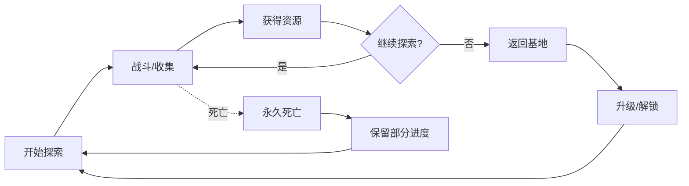
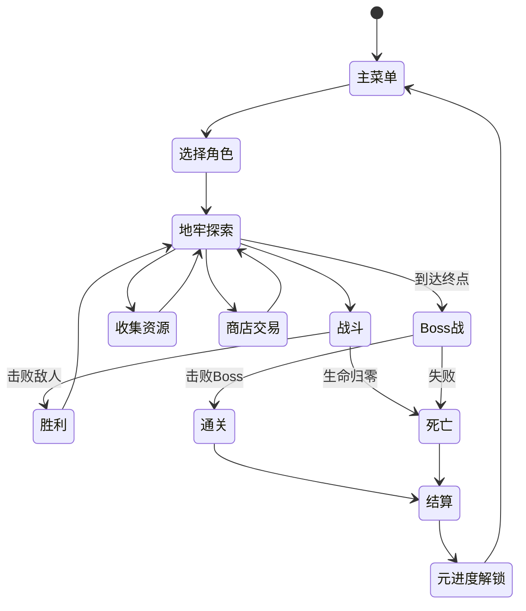
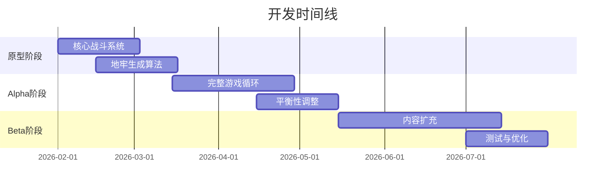
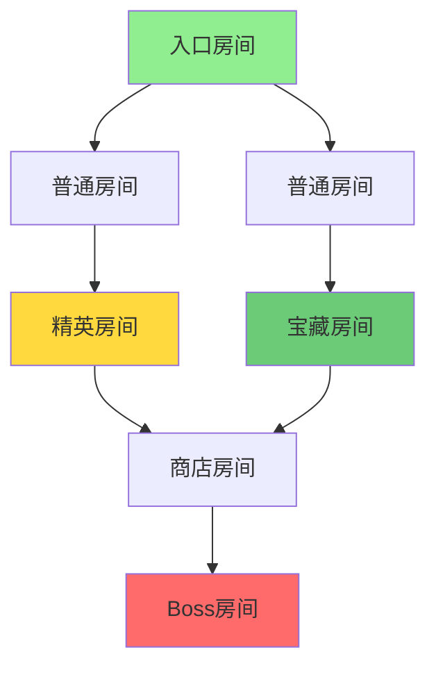
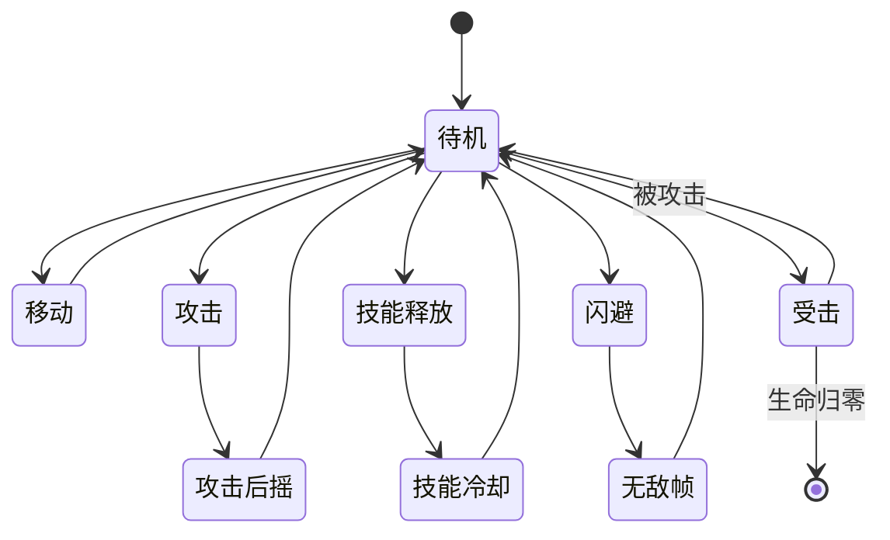
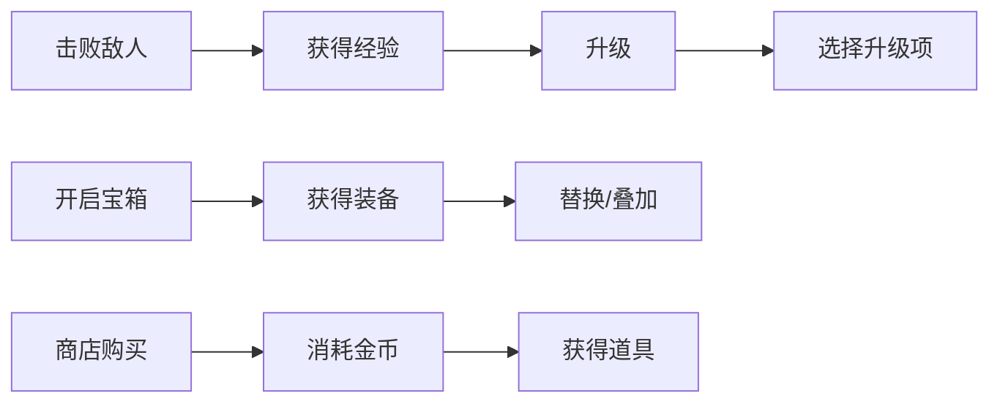
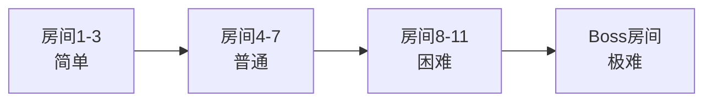

# 游戏策划文档

## 游戏概述

# 游戏概述

## 1. 游戏定位

**类型**: 2D Roguelike 地牢探索游戏  
**视角**: 俯视视角  
**核心体验**: 随机生成地牢探索 + 永久死亡 + 成长养成

## 2. 核心玩法循环

## 3. 游戏特色

- **随机生成**: 每次探索地牢布局、敌人分布、宝藏位置完全随机
- **永久死亡**: 角色死亡后重新开始，但保留元进度解锁
- **策略深度**: 资源管理、技能搭配、风险评估
- **快节奏**: 单局15-30分钟，适合碎片化游戏

## 4. 目标玩家

- Roguelike爱好者
- 喜欢挑战和随机性的玩家
- 追求策略深度的核心玩家
- 时间有限但追求高强度体验的玩家

## 5. 游戏流程

## 6. 平台与技术

**目标平台**: PC (Steam)  
**开发引擎**: 待定  
**美术风格**: 像素风格 / 低多边形 (待确认)

## 7. 开发里程碑

## 8. 成功指标

- 单局平均游戏时长: 20-25分钟
- 玩家留存率 (7日): >30%
- 平均通关率: 15-20%
- Steam好评率: >80%

## 核心玩法

# 核心玩法

## 1. 地牢探索机制

### 1.1 地牢结构

**房间类型**:
- **普通房间**: 基础战斗，2-5个敌人
- **精英房间**: 强力敌人，掉落稀有奖励
- **宝藏房间**: 装备/道具，无战斗
- **商店房间**: 消耗金币购买物品
- **Boss房间**: 关卡终点，击败后通关

### 1.2 探索流程

1. 玩家从入口进入随机生成的地牢
2. 选择路线前进（可见相邻房间类型）
3. 进入房间触发事件（战斗/奖励/商店）
4. 完成后解锁相邻房间
5. 重复直到到达Boss房间或死亡

## 2. 战斗系统

### 2.1 战斗核心

**实时动作战斗**:
- 移动: WASD / 方向键
- 攻击: 鼠标左键 / 空格
- 技能: Q/E/R (冷却时间)
- 闪避: Shift (消耗耐力)

### 2.2 战斗状态机

### 2.3 属性系统

**基础属性**:
- 生命值 (HP): 归零则死亡
- 耐力值 (Stamina): 闪避和冲刺消耗
- 攻击力: 影响伤害输出
- 防御力: 减少受到伤害
- 移动速度: 影响位移效率

**衍生属性**:
- 暴击率/暴击伤害
- 攻击速度
- 技能冷却缩减
- 生命恢复

## 3. 成长系统

### 3.1 局内成长

**升级选项** (每次升级3选1):
- 属性提升: +10% 攻击力
- 技能强化: 减少冷却时间
- 被动效果: 击败敌人恢复生命

**装备槽位**:
- 武器: 决定攻击方式
- 护甲: 提供防御和特殊效果
- 饰品: 被动加成 (最多3个)

### 3.2 元进度系统

**永久解锁** (死亡后保留):
- 新角色解锁
- 新武器/装备池扩充
- 起始属性提升
- 特殊天赋解锁

**货币系统**:
- 金币: 局内使用，死亡清零
- 灵魂: 永久货币，用于元进度

## 4. 随机性设计

### 4.1 地牢生成

**随机要素**:
- 房间布局和连接方式
- 房间内敌人种类和数量
- 宝藏内容和品质
- 商店物品刷新

**固定要素**:
- 房间总数 (12-15个)
- Boss房间位置 (最深处)
- 基础难度曲线

### 4.2 奖励随机

**品质等级**:
- 普通 (白): 70%
- 稀有 (蓝): 20%
- 史诗 (紫): 8%
- 传说 (橙): 2%

## 5. 难度设计

### 5.1 难度曲线

### 5.2 难度调节

**敌人强度**:
- 前期: 生命低，攻击慢
- 中期: 引入特殊技能
- 后期: 组合攻击，高威胁

**资源平衡**:
- 生命恢复道具稀缺
- 金币获取有限
- 装备选择需取舍

## 6. 核心循环

**单局流程** (15-30分钟):
1. 选择角色和初始装备
2. 探索地牢 (10-12个房间)
3. 战斗获取资源和升级
4. 挑战Boss
5. 通关/死亡结算
6. 使用灵魂进行元进度

**长期循环**:
- 解锁新内容 → 尝试新玩法 → 挑战更高难度 → 解锁更多内容

## 地牢系统设计

## 战斗系统

## 角色成长系统

## 道具与装备系统

## Roguelike机制

## 美术风格

## 技术实现

## 开发计划

