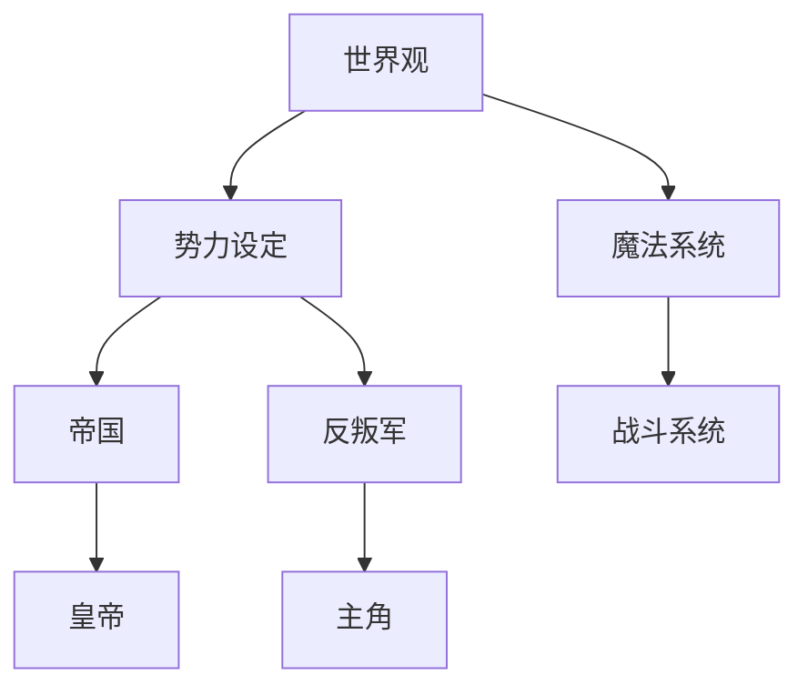

# 全局关系图谱 (World Graph)

使用 Mermaid 定义项目中的高层依赖关系。
Context系统会自动解析 `A --> B`，当你提到 A 时自动加载 B。

```mermaid
graph TD
    %% 核心世界观
    WorldView[世界观] --> Factions[势力设定]
    WorldView --> MagicSystem[魔法系统]

    %% 势力关系
    Factions --> Empire[帝国]
    Factions --> Rebels[反叛军]

    %% 角色归属
    Empire --> Emperor[皇帝]
    Rebels --> Hero[主角]

    %% 玩法关联
    MagicSystem --> Combat[战斗系统]
```
